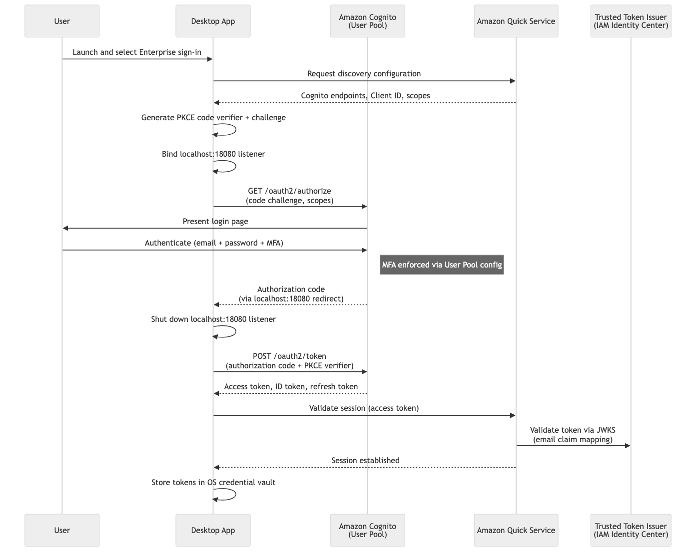

# Amazon Quick on desktop: Cognito OpenID Connect (OIDC) Provider

[Amazon Quick on desktop](https://docs.aws.amazon.com/quick/latest/userguide/amazon-quick-desktop.html) for enterprise customers requires an [OIDC provider](https://docs.aws.amazon.com/quick/latest/userguide/desktop-enterprise-setup.html). As stated in the documentation, you can use a compatible OIDC provider such as Entra ID, Okta, Auth0, or PingOne. You can also use [Amazon Cognito](https://docs.aws.amazon.com/cognito/latest/developerguide/cognito-user-pools-identity-federation.html) as an OIDC provider. This sample, deployable through the AWS Cloud Development Kit (CDK) and AWS CloudFormation, provides the infrastructure for that solution.

This solution is designed for customers who do not have or want to use one of the aforementioned OIDC providers and use local Amazon Quick users or AWS IAM Identity Center without a federated identity provider (IdP). As with all Quick desktop setup, emails used in Amazon Quick must also match the emails in your OIDC provider. See below for details on deployment and synchronization of users.

If you already have an IdP (Entra ID, Okta, PingOne, or a compatible OIDC provider), you don't need this stack. Use the [enterprise setup guide](https://docs.aws.amazon.com/quick/latest/userguide/desktop-enterprise-setup.html) instead.

## Architecture

The following sequence diagram shows the Amazon Quick desktop authentication flow:



The stack deploys an Amazon Cognito User Pool with a hosted UI domain and a public app client. The desktop app points directly at the Cognito hosted UI OAuth endpoints (`/oauth2/authorize` and `/oauth2/token`). New users are provisioned by an admin and receive a Cognito invitation email; they set their own password on first sign-in.

## Important security considerations

Review and apply these before using the stack in production. AWS reference documentation is linked for each control.

### Multi-factor authentication (MFA)

Deploy with `-c mfaRequired=true` to require authenticator-app MFA for all users. See [Adding MFA to a user pool](https://docs.aws.amazon.com/cognito/latest/developerguide/user-pool-settings-mfa.html).

```bash
cdk deploy -c mfaRequired=true
```

### User Pool hardening

The deployed User Pool uses minimal defaults. Review and adjust the configuration in [`lib/construct-groups/identity-provider.ts`](https://github.com/aws-samples/sample-amazon-quick-suite-knowledge-hub/blob/main/amazon-quick-on-desktop/lib/construct-groups/identity-provider.ts) to meet your organization's security policies.

| Requirement | CDK property | AWS reference |
|-------------|--------------|---------------|
| Password policy (length, complexity, expiry) | `passwordPolicy` | [Passwords and password policies](https://docs.aws.amazon.com/cognito/latest/developerguide/managing-users-passwords.html) |
| Multi-factor authentication | `mfa`, `mfaSecondFactor` | [Adding MFA](https://docs.aws.amazon.com/cognito/latest/developerguide/user-pool-settings-mfa.html) |
| Account recovery | `accountRecovery` | [Passwords and account recovery](https://docs.aws.amazon.com/cognito/latest/developerguide/managing-users-passwords.html) |
| Advanced security (threat protection / adaptive auth) | `advancedSecurityMode` | [Threat protection](https://docs.aws.amazon.com/cognito/latest/developerguide/cognito-user-pool-settings-threat-protection.html) |
| Custom domain | `customDomain` | [Custom domains](https://docs.aws.amazon.com/cognito/latest/developerguide/cognito-user-pools-add-custom-domain.html) |
| Token validity | `accessTokenValidity`, `idTokenValidity` | [Token expiration](https://docs.aws.amazon.com/cognito/latest/developerguide/amazon-cognito-user-pools-using-tokens-caching-tokens.html) |
| Callback URLs | `callbackUrls` | — |
| Removal policy (retain on stack delete) | `-c retain=true` | — |

To enforce MFA and a stricter password policy:

```typescript
this.pool = new cognito.UserPool(this, 'Pool', {
  // ...existing props
  mfa: cognito.Mfa.REQUIRED,
  mfaSecondFactor: { sms: false, otp: true },
  passwordPolicy: {
    minLength: 12,
    requireUppercase: true,
    requireDigits: true,
    requireSymbols: true,
    tempPasswordValidity: Duration.days(3),
  },
  advancedSecurityMode: cognito.AdvancedSecurityMode.ENFORCED,
});
```

For an overview of all user pool security features, see [Using Amazon Cognito user pools security features](https://docs.aws.amazon.com/cognito/latest/developerguide/managing-security.html).

## Prerequisites

- AWS account with an active Amazon Quick subscription
- Node.js 18+, AWS CDK CLI, and configured AWS credentials
- Python 3.12+ (user sync script)

## Setup

Follow these steps in order. Steps 1–2 deploy the stack and collect its outputs, steps 3–4 connect it to Amazon Quick and provision users, and step 5 signs in.

### Step 1: Deploy the stack

Install dependencies and deploy:

```bash
npm install
cdk deploy
```

To require MFA (authenticator app) for all users:

```bash
cdk deploy -c mfaRequired=true
```

To retain the User Pool when the stack is destroyed:

```bash
cdk deploy -c retain=true
```

### Step 2: Retrieve the stack outputs

You will use these values in Step 3.

```bash
aws cloudformation describe-stacks \
  --stack-name QuickDesktopCognitoStack \
  --query "Stacks[0].Outputs" --output table
```

| Output | Description |
|--------|-------------|
| `PoolId` | Cognito User Pool ID |
| `ClientId` | App client ID (also used as the `aud` claim) |
| `IssuerUrl` | OIDC issuer URL |
| `AuthEndpoint` | Authorization endpoint (Cognito hosted UI) |
| `TokenEndpoint` | Token endpoint (Cognito hosted UI) |
| `JwksUri` | JSON Web Key Set URI |

### Step 3: Configure Amazon Quick

In the Amazon Quick management console, configure extension access and create the extension using the Step 2 outputs. Map the fields as follows:

| Amazon Quick field | Stack output |
|--------------------|--------------|
| Client ID / Aud claim | `ClientId` |
| Issuer URL | `IssuerUrl` |
| Authorization endpoint | `AuthEndpoint` |
| Token endpoint | `TokenEndpoint` |
| JWKS URI | `JwksUri` |

For the complete instructions, follow [Step 2 in the enterprise setup guide](https://docs.aws.amazon.com/quick/latest/userguide/desktop-enterprise-setup.html).

### Step 4: Create and sync users

The included script copies users from IAM Identity Center or local Amazon Quick into the Cognito User Pool. It auto-discovers the pool ID from the deployed stack, shows a plan, and prompts for confirmation before creating each user.

```bash
python3 scripts/sync_users.py --source idc    # from IAM Identity Center
python3 scripts/sync_users.py --source local  # from local Amazon Quick users
```

Each created user receives a Cognito invitation email containing their username and a one-time temporary password generated by Cognito. On first sign-in they are required to set their own password — the password is never set or seen by the administrator. For users who already exist but have not yet signed in, the script offers to resend the invitation. Requires Python 3.12+ and `boto3`.

The invitation arrives from an address like `no-reply@verificationemail.com <no-reply@verificationemail.com>` with the subject **"[EXTERNAL] Your temporary password"** and a body such as:

> Your username is <your user name> and temporary password is <your password>.

These are the credentials for signing into Amazon Quick on desktop.

The email on each Cognito user must exactly match the user's email in Amazon Quick.

> **Email delivery:** By default the User Pool sends invitation emails using Cognito's built-in email, which is rate-limited and intended for testing. For production, configure Amazon SES on the User Pool.

### Step 5: Sign in

Launch the Amazon Quick desktop application and select **Enterprise sign-in**. Sign in with your email and the temporary password from the invitation email (and MFA, if enabled). You are prompted to set your own password on first login. The desktop app stores the resulting tokens in the OS credential vault.

## Keeping users in sync

The sync script is a manual, interactive tool for initial provisioning. It does not run automatically, does not detect removed users, and requires re-running whenever your identity source changes.

For production, you need an automated mechanism. You could trigger a Lambda function on a schedule (or in response to IAM Identity Center events) that reconciles users between your source of truth and the Cognito pool. If your upstream IdP supports System for Cross-domain Identity Management (SCIM), a connector or middleware can push user lifecycle events to Cognito directly. Alternatively, maintain a user manifest in source control and sync it on merge via a pipeline step.

The sync script's `CognitoUserSyncer` and lister classes can be extracted into a Lambda function with minimal changes. Without automated sync, users added or removed from your identity source won't be reflected in the pool until you manually intervene.

## Cleanup

```bash
cdk destroy
```

Manually delete the extension access and extension from the Amazon Quick management console.

## Security

See [CONTRIBUTING](https://github.com/aws-samples/sample-amazon-quick-suite-knowledge-hub/blob/main/CONTRIBUTING.md#security-issue-notifications) for more information.

## License

This sample is licensed under the MIT-0 License. See the repository [LICENSE](https://github.com/aws-samples/sample-amazon-quick-suite-knowledge-hub/blob/main/LICENSE).
