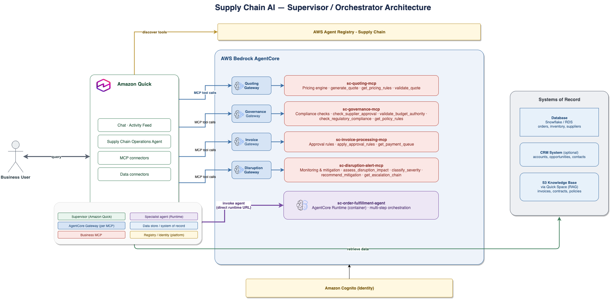
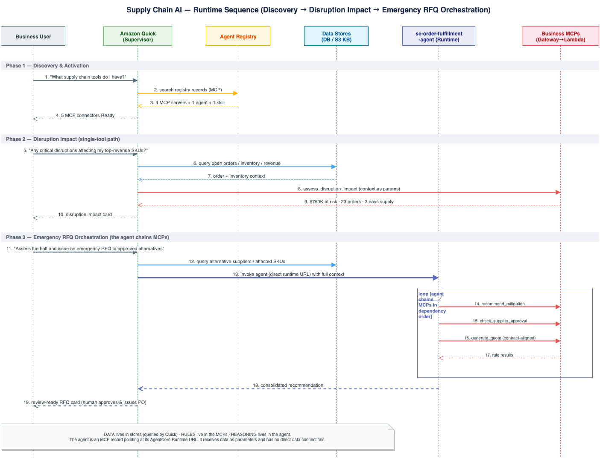
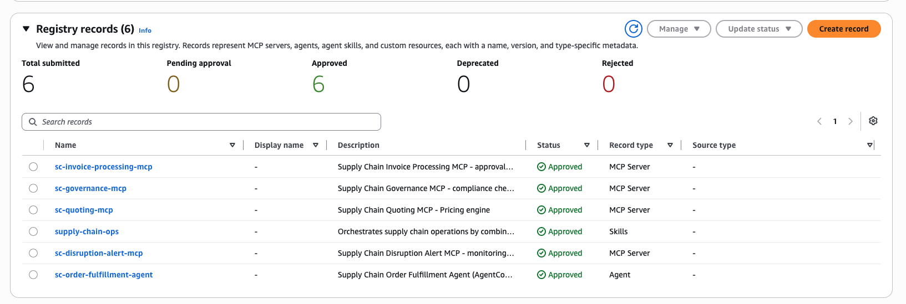
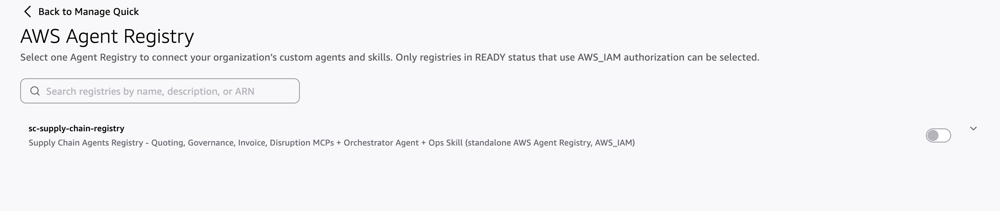
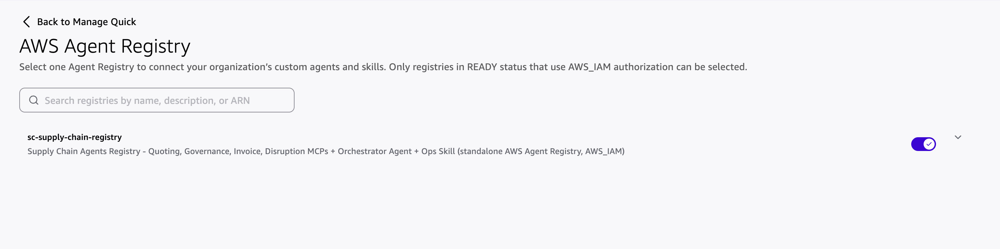
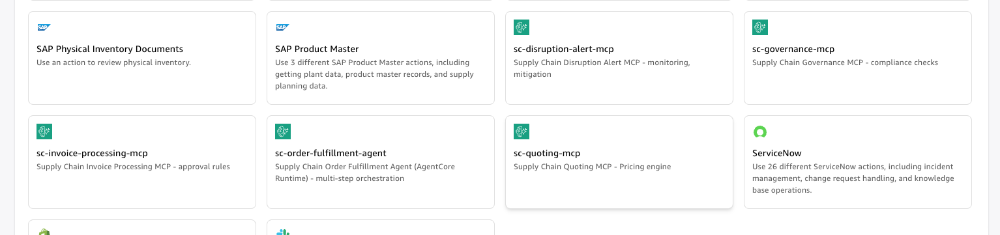
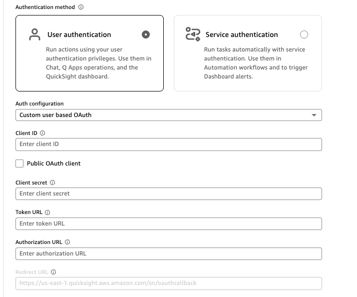
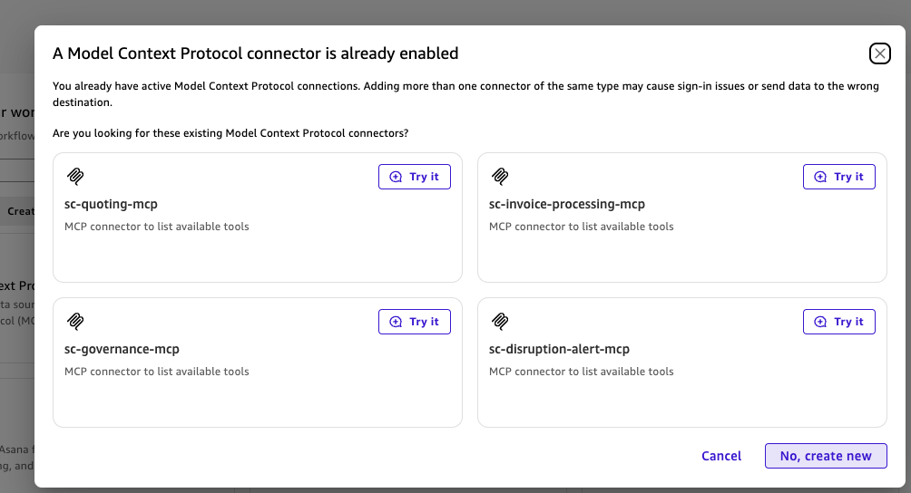

# Amazon Quick for Supply Chain

> Conversational supply chain intelligence on Amazon Bedrock AgentCore and Amazon Quick, using a supervisor/orchestrator pattern over MCP tools.

End-to-end **Order Management & Supply Chain** solution built on a
**supervisor–orchestrator** pattern: **Amazon Quick** is the supervisor that
discovers and orchestrates specialized tools, **AWS AgentCore** hosts the
business-rule MCP servers and the reasoning agent, and the **AWS Agent
Registry** is the governed discovery catalog. Structured data lives in **your
database of choice** (Snowflake, PostgreSQL/RDS, or any SQLAlchemy-supported
engine), CRM data in **Salesforce** (optional), and unstructured documents in an
**S3 knowledge base** surfaced in the Quick Space (for RAG).

Deployment runs in **three phases** - (1) the AgentCore infrastructure as one
CloudFormation/SAM stack, (2) synthetic data generation + S3 upload, and (3) the
Amazon Quick datasets, knowledge base, Space, and agent - with a small set of
console-only manual steps in between.

---

## Table of Contents

1. [Architecture](#architecture)
2. [How Users Interact (End-to-End Flow)](#how-users-interact-end-to-end-flow)
3. [Repository Layout](#repository-layout)
4. [Prerequisites](#prerequisites)
5. [Deploy - Phase 1: AgentCore infrastructure](#deploy---phase-1-agentcore-infrastructure)
6. [Deploy - Phase 2: Synthetic data + S3](#deploy---phase-2-synthetic-data--s3)
7. [Manual steps (AWS console - required between Phase 2 and 3)](#manual-steps-aws-console---required-between-phase-2-and-3)
8. [Deploy - Phase 3: Quick datasets, KB, Space, agent](#deploy---phase-3-quick-datasets-kb-space-agent)
9. [End-to-End Order](#end-to-end-order)
10. [Test / Demo Flow](#test--demo-flow)
11. [Components Reference](#components-reference)
12. [Design Principles](#design-principles)
13. [Troubleshooting](#troubleshooting)
14. [Teardown](#teardown)

---

## Architecture



*High-level architecture: Amazon Quick (supervisor) over the AgentCore-hosted MCP
business-rule servers and the order-fulfillment reasoning agent, with the AWS Agent
Registry as the discovery catalog and data in the Quick Space (datasets + S3 knowledge base).*

```
Amazon Quick (Supervisor / Orchestrator)
  │
  ├── Database (via Quick Space)      ── Structured data (orders, inventory, suppliers…)
  ├── Salesforce connector (optional) ── CRM data (accounts, opportunities, contacts)
  ├── S3 knowledge base (via Space)   ── Unstructured docs (invoices, contracts) for RAG
  ├── AWS Agent Registry              ── Discovery catalog (6 records)
  │
  ├── sc-quoting-mcp                  ── Pricing rules            (AgentCore Gateway → Lambda)
  ├── sc-governance-mcp               ── Compliance rules         (AgentCore Gateway → Lambda)
  ├── sc-invoice-processing-mcp       ── Approval rules           (AgentCore Gateway → Lambda)
  ├── sc-disruption-alert-mcp         ── Impact assessment        (AgentCore Gateway → Lambda)
  │
  └── sc-order-fulfillment-agent      ── Multi-step reasoning      (AgentCore Runtime, container)
        │  reached DIRECTLY via its runtime invocation URL
        │  (registered as an AGENT record; connector configured manually)
        ├── calls sc-quoting-mcp
        ├── calls sc-governance-mcp
        ├── calls sc-invoice-processing-mcp
        └── calls sc-disruption-alert-mcp
```

**Layer mapping (supervisor–orchestrator pattern):**

| Layer | Role | Implementation |
|-------|------|----------------|
| User Experience | Discovery, decisions, notifications | Amazon Quick UI + connectors |
| Agent Interaction | Skills / super-agents | Quick Skill `supply-chain-ops` |
| Agent↔Agent | Routing + orchestration | AgentCore Gateway (MCP) + Runtime |
| Service Layer | Single-task agents | 4 business MCPs + 1 Agent (in Agent Registry) |
| Data / RBAC | AuthN/Z | Cognito (JWT) + resource-server scopes |
| Data Stores | Structured + unstructured | Database (Snowflake/RDS/…), Salesforce, S3 knowledge base |

---

## How Users Interact (End-to-End Flow)

A business user works entirely in **Amazon Quick Chat** using natural language.
Quick (the supervisor) owns the data connectors and UX; it queries data, calls
the MCP business-rule tools, optionally invokes the reasoning agent, and returns
a decision or a branded document.



*Sequence of a request: the user asks Quick, Quick queries the Space data, passes
the facts to the relevant MCP business-rule server (or the order-fulfillment agent
for multi-step requests), then synthesizes the answer and confirms any writes.*

**The pattern for every request:**
`User asks Quick → Quick queries data (Space datasets / Salesforce / docs) → Quick passes
that data to the relevant MCP → MCP applies rules → Quick synthesizes the
answer (often a branded HTML/DOCX artifact) and asks for approval on writes.`

### Golden-path walkthrough (≈5 min)

| # | User says (in Quick Chat) | What happens |
|---|---------------------------|--------------|
| 1 | "What supply chain capabilities do we have?" | Quick searches the **Agent Registry** → lists the 6 records (4 business MCPs, 1 agent [AGENT record], 1 skill). |
| 2 | "Activate the Supply Chain Operations skill." | The `supply-chain-ops` skill loads and connects the MCP tools. |
| 3 | *[attach `Invoice_SUP-INV-40003.txt` from `synthetic_data/documents/`]* "Process this invoice." | Quick extracts the doc, queries the matching PO from the Space datasets, calls **sc-invoice-processing-mcp** → detects a variance → **DIRECTOR_REVIEW** decision card. (`Invoice_SUP-INV-40001.txt` is the clean AUTO-APPROVE case.) |
| 4 | "Generate a quote for Sample Manufacturing Co 03, 1000 units of Sample Component 03 (SKU-103), align with contract CTR-2026-003." | Quick pulls tier/contract/product data from the Space datasets, calls **sc-quoting-mcp** → renders a branded HTML + DOCX quote. |
| 5 | "Any active disruptions? Assess impact and find alternatives." | Quick invokes the **sc-order-fulfillment-agent** connector (the AgentCore Runtime, reached directly via its runtime invocation URL) → the **agent** chains disruption + governance + quoting MCPs → returns a contingency plan. |

### More prompts that invoke the `sc-order-fulfillment-agent`

These are **multi-step** requests (3+ MCPs / combined reasoning), so Quick routes them
to the order-fulfillment agent rather than a single MCP. They use real generated
entities so they run as-is.

| User says (in Quick Chat) | What the agent chains |
|---------------------------|-----------------------|
| "Process our open orders end-to-end and flag anything that needs review." | disruption + governance + invoice + quoting → consolidated per-order plan |
| "New order for Sample Manufacturing Co 03: 1000 units SKU-103. Validate the customer, generate a quote against contract CTR-2026-003, and check compliance before we commit." | quoting + governance (+ inventory) → quote + go/no-go |
| "ALERT-002 just hit APAC. Assess the impact on our open orders, find alternative suppliers, and re-quote the affected lines." | disruption → governance (approved alternates) → quoting (re-quote) → contingency plan |
| "Can we fulfill a 5,000-unit order of SKU-103 for an Enterprise customer this quarter? Check inventory, supplier capacity, and pricing." | inventory/data + governance + quoting → feasibility answer |
| "Supplier Sample Supplier Co 04 is flagged. Assess exposure across open POs and invoices, and recommend mitigation." | governance + invoice + disruption reasoning → risk + mitigation |

> **Routing note:** single-tool asks (one quote, one supplier check, the payment
> queue) go **directly** to the relevant MCP — not the agent. Use the agent only when
> the request spans multiple domains or needs combined reasoning (see the skill's
> "When to call the agent" table in `skill/SKILL.md`).

### Representative single-tool asks

| Ask | Tools exercised |
|-----|-----------------|
| "Is a given supplier approved?" | Space datasets → `sc-governance-mcp.check_supplier_approval` |
| "Does our Regional Manager have budget authority for a $72,000 PO?" | `sc-governance-mcp.validate_budget_authority` |
| "Show me the payment queue." | `sc-invoice-processing-mcp.get_payment_queue` |
| "Which products are below reorder point?" | Space datasets (direct query) |
| "A major port just closed - what's our exposure?" | Web search + Space datasets + `sc-disruption-alert-mcp` |

### Who owns what

- **Quick = Supervisor agent** - owns all data connectors, the UX, and executes writes.
- **`sc-order-fulfillment-agent` = Specialist agent** - owns multi-step reasoning; receives data as parameters (it has **no** direct data connections).
- **MCPs = deterministic tools** - apply business rules only; they hold no data.

---

## Repository Layout

```
.
├── README.md                        ← You are here (the single source of docs)
├── template.yaml                    ← Unified SAM stack: Cognito + 4 Lambdas + 4 Gateways + 4 Targets + Runtime
├── deploy_agentcore.sh              ← PHASE 1: build container → sam deploy → register (Cognito + 4 MCPs + Runtime + 6 registry records)
├── generate_and_upload.sh           ← PHASE 2: generate synthetic_data/ → upload dataset CSVs + KB docs to S3
├── setup_quick.sh                   ← PHASE 3: Quick datasets + S3 KB + Space + agent (from the S3 bucket)
│
├── src/
│   ├── agents/
│   │   ├── order-fulfillment/       ← Agent container for AgentCore Runtime (main.py, Dockerfile)
│   │   ├── mcp-quoting/             ← generate_quote, get_pricing_rules, validate_quote
│   │   ├── mcp-governance/          ← supplier/budget/regulatory checks, audit
│   │   ├── mcp-invoice-processing/  ← apply_approval_rules, get_payment_queue
│   │   └── mcp-disruption-alert/    ← assess_disruption_impact, classify_severity, recommend_mitigation, get_escalation_chain
│   └── common/auth_helper.py        ← shared auth utilities
│
├── registry/
│   └── deploy_registry.py           ← Registers records to the standalone AWS Agent Registry (GA)
│
├── generate_synthetic_data/         ← Separate, idempotent data pipeline (see "Phase 2")
│   ├── load_data.sh                 ← One-shot data orchestrator (generate → DB → S3 → Salesforce)
│   ├── pipeline/                    ← Loader package (import as generate_synthetic_data.pipeline.*)
│   │   ├── config.py  db_loader.py (engine-aware)  s3_uploader.py  salesforce_prep.py
│   │   ├── snowflake_loader.py (back-compat shortcut)  requirements.txt
│   │   └── loaders/                 ← base.py + snowflake / postgres / sqlalchemy engines
│   ├── generators/                  ← generate_all_data.py, generate_documents.py, schema.py (schema + DDL)
│   └── mock/                        ← Salesforce mock JSON fixtures
├── synthetic_data/                  ← GENERATED data artifacts - produced at runtime (gitignored)
│   ├── structured/tables/*.csv      ← 19 per-table CSVs (no SQL; schema lives in generators/schema.py)
│   ├── documents/                   ← invoices & contracts + GENERATION_GUIDE.md
│   └── salesforce/                  ← Accounts.csv, Contacts.csv, Opportunities.csv
├── skill/                           ← The `supply-chain-ops` Quick desktop skill (Quick Skills standard)
│   ├── SKILL.md                     ← Frontmatter + workflow
│   ├── references/                  ← Lookup data (connectors, data-queries, routing, presentation, branding)
│   ├── assets/                      ← quote-template.html
│   └── README.md                    ← Skill install notes
├── agent/
│   └── AGENT_INSTRUCTIONS.md        ← CustomInstructions body for the Quick agent (used by setup_quick.sh)
└── docs/                            ← Architecture/sequence diagrams + console screenshots (PNG)
```

> **Agent Registry (GA):** records live in the standalone `agent-registry` service
> (ARNs `arn:aws:agent-registry:...`, console `console.aws.amazon.com/agent-registry`),
> not the legacy registry embedded in Bedrock AgentCore. Registration requires
> **boto3 ≥ 1.43.94** (already handled by `deploy_agentcore.sh`, which uses the project venv).

---

## Prerequisites

- An AWS account with **Amazon Bedrock AgentCore** + **AWS Agent Registry** access
  (regions: us-east-1, us-west-2, eu-west-1, ap-northeast-1, ap-southeast-2)
- **AWS CLI v2**, **AWS SAM CLI**, and **Docker** (the agent runs as an arm64 container)
- **Python 3.12+** with **boto3 ≥ 1.43.94** for the registry step
- Credentials for the target account exported/active (`aws sts get-caller-identity` should show it)
- *(For data)* a database (Snowflake, PostgreSQL/RDS, or any SQLAlchemy engine),
  an S3 bucket, and optionally a Salesforce org
- *(For the UX)* Amazon Quick

---

## Deployment at a glance

| Step | Script / Action | What it does |
|------|-----------------|--------------|
| **Phase 1** | [`deploy_agentcore.sh`](https://github.com/aws-samples/sample-amazon-quick-suite-knowledge-hub/blob/main/examples/quick-for-supply-chain/deploy_agentcore.sh) `[env] [--recreate]` | Build+push the agent container, `sam deploy` the stack (Cognito + 4 MCP Lambdas + gateways + targets + runtime), register 6 records to the Agent Registry. |
| **Phase 2** | [`generate_and_upload.sh`](https://github.com/aws-samples/sample-amazon-quick-suite-knowledge-hub/blob/main/examples/quick-for-supply-chain/generate_and_upload.sh) `[--bucket <name>]` | Generate synthetic data, create the S3 bucket, upload dataset CSVs (`structured/`) + documents (`knowledge-base/`). Prints the bucket name. |
| **Manual** | AWS console | (1) Grant Quick/QuickSight access to Amazon S3 **and Amazon Athena**. (2) Link the AWS Agent Registry in Quick + create the MCP connectors. |
| **Phase 3** | [`setup_quick.sh`](https://github.com/aws-samples/sample-amazon-quick-suite-knowledge-hub/blob/main/examples/quick-for-supply-chain/setup_quick.sh) `--s3-bucket <b> (--quicksight-user <u> \| --quicksight-group <g>) [--action-connectors <ids>]` | Create QuickSight datasets + S3 knowledge base + Space + the Quick agent (attached to the Space), and share as owner. |

Supporting code: [`registry/deploy_registry.py`](https://github.com/aws-samples/sample-amazon-quick-suite-knowledge-hub/blob/main/examples/quick-for-supply-chain/registry/deploy_registry.py) (registry records),
[`generate_synthetic_data/`](https://github.com/aws-samples/sample-amazon-quick-suite-knowledge-hub/tree/main/examples/quick-for-supply-chain/generate_synthetic_data) (data generators + DB loaders),
[`agent/AGENT_INSTRUCTIONS.md`](agent/AGENT_INSTRUCTIONS.md) (the Quick agent's instructions).

---

## Deploy - Phase 1: AgentCore infrastructure

Deploy the entire AgentCore stack + Agent Registry with one command. No separate
Cognito or gateway steps, no manual CLI resource creation:

```bash
./deploy_agentcore.sh dev                # deploy/update (default env: dev)
./deploy_agentcore.sh dev --recreate     # DESTROY the existing stack + registry, then redeploy fresh
```

**What it creates**, in order:

1. *(with `--recreate`)* **Tears down** the existing Agent Registry (records +
   registry) and the CloudFormation stack, waiting for deletion to finish.
2. Ensures an **ECR** repository and **builds + pushes** the agent container (`linux/arm64`).
3. `sam build` then **one `sam deploy`** of `template.yaml`, creating:
   - **Cognito** user pool + resource server + **one app client** (user-based
     authorization-code OAuth — used by the Quick connectors *and* by the runtime,
     which signs in as the test user) + domain
     + a **test user** (`supply-chain-test-user`) for the connector OAuth sign-in
   - **4 business MCP Lambdas** (quoting, governance, invoice-processing, disruption-alert)
   - **4 AgentCore Gateways** (`CUSTOM_JWT`) + **4 Gateway Targets** (Lambda + tool schemas)
   - **1 AgentCore Runtime** (the agent container) + least-privilege IAM roles
4. Prints stack outputs (gateway URLs, runtime ARN, pool/client/domain).
5. Registers all **6 records** to the standalone **AWS Agent Registry** and approves them
   (`registry/deploy_registry.py`).



*AWS Agent Registry console → Registry records: all **6 records Approved** — the 4
business MCPs (Record type **MCP Server**), `sc-order-fulfillment-agent` (Record type
**Agent**), and `supply-chain-ops` (Record type **Skills**).*

It is **account/region-agnostic** (account via STS, region via `AWS_REGION`,
default `us-east-1`) and idempotent - re-running updates the same resources.

> **Auth note:** This solution uses a **single Cognito app client** with the
> **authorization-code (user)** OAuth flow. The Quick MCP connectors sign in with it
> interactively, and the order-fulfillment runtime signs in as the **test user**
> (`USER_PASSWORD_AUTH`) to mint a token for calling the gateways. The gateways'
> `CUSTOM_JWT` authorizer validates the pool issuer + this client id (it does not
> require a machine-to-machine grant), so one client covers both paths. The Quick
> Redirect URL is pre-registered as the client's callback (region-aware).

### Verify Phase 1

```bash
REGION=us-east-1
aws cloudformation describe-stacks --stack-name sc-agents-dev --region $REGION \
  --query "Stacks[0].StackStatus" --output text                     # CREATE_COMPLETE
aws bedrock-agentcore-control list-gateways --region $REGION \
  --query "items[?starts_with(name,'sc-')].{n:name,s:status}" --output table   # 4 READY
aws bedrock-agentcore-control list-agent-runtimes --region $REGION \
  --query "agentRuntimes[?starts_with(agentRuntimeName,'sc_')].status" --output text  # READY
```

---

## Deploy - Phase 2: Synthetic data + S3

Generate the demo data and upload it to S3. **No QuickSight calls** - datasets,
KB, Space, and agent are all created later in Phase 3.

```bash
./generate_and_upload.sh                       # bucket: sc-supply-chain-data-<account>-<region>
./generate_and_upload.sh --bucket my-bucket    # use a custom bucket name
AWS_REGION=us-west-2 ./generate_and_upload.sh  # target another region
```

**What it does:**

1. Runs `generate_all_data.py --output ./synthetic_data/` to (re)generate the
   synthetic, deterministic dataset (seeded - no real names/emails/addresses).
2. Creates the **S3 bucket** if missing (region-aware) with **AES256** default encryption.
3. Uploads:
   - `synthetic_data/structured/tables/*.csv` → `s3://<bucket>/structured/`
   - `synthetic_data/documents/*` → `s3://<bucket>/knowledge-base/`
4. **Prints the bucket name** - you pass it to Phase 3 (`setup_quick.sh --s3-bucket <bucket>`).

All data is **synthetic and deterministic** - generated from a seeded Python
generator (`random.Random(42)`), so every run produces the same data with **no
real company names, emails, or addresses** (uses `Sample …` names, `example.com`
emails, `555-…` phones). The schema lives in
`generate_synthetic_data/generators/schema.py`.

> **Optional: use any database you prefer.** This sample stores the structured
> data in **S3** (the datasets + knowledge base are built from the S3 bucket in
> Phase 3). If you'd rather use a database, load
> `synthetic_data/structured/tables/*.csv` into whatever DB you run
> (Snowflake / PostgreSQL / RDS / any SQLAlchemy engine via `DB_ENGINE`) and connect
> it to the Space as a data source. See `generate_synthetic_data/pipeline/`
> (`db_loader.py`, engine loaders); the schema + `CREATE TABLE` DDL come from
> `generate_synthetic_data/generators/schema.py` (single source of truth).
> Salesforce is likewise optional (`salesforce_prep.py`); the same CRM data is in
> the CSVs and Quick reads it there.

---

## Manual steps (AWS console - required between Phase 2 and 3)

These two steps are done once in the console. Do them **after Phase 2
and before Phase 3**.

**1. Grant Amazon Quick / QuickSight access to Amazon S3 AND Amazon Athena.**
Amazon QuickSight console → **Manage QuickSight → Security & permissions →
QuickSight access to AWS services → Manage**, then:
- **Amazon S3** → **Select S3 buckets** → **check** the bucket that Phase 2 printed
  (default `sc-supply-chain-data-<account>-<region>`).
- **Amazon Athena** → **check** it as well.

Then **Save**. Phase 3 serves each table through a **single Athena data source**
over a Glue database, so QuickSight needs **both** S3 and Athena access. Without
S3, dataset/KB creation fails with an S3 access error. **Without Athena, the
Athena data source is created in `CREATION_FAILED` (ACCESS_DENIED — "the
QuickSight service role … has not been created yet"), and then every dataset
create fails**, leaving the Space with no structured data.
See the [S3 integration guide](https://docs.aws.amazon.com/quick/latest/userguide/s3-integration.html).


*QuickSight → Security & permissions → Amazon S3: the Phase 2 bucket
(`sc-supply-chain-data-<account>-<region>`) checked for access (and write, for
Athena query results).*


*Same panel: **Amazon Athena** must also be checked (alongside Amazon S3). This
lets QuickSight create the Athena data source Phase 3 uses to catalog the CSV
tables. Missing it is the #1 cause of Phase 3 creating 0 datasets.*

**2. Link the AWS Agent Registry in Quick + create the MCP connectors.**
- **Link the registry (admin, one-time):** Quick admin console → **Manage account →
  Permissions → AWS Agent Registry** → toggle on **`sc-supply-chain-registry`** and
  confirm. (Prereqs, all satisfied by Phase 1: same account + region, **AWS_IAM**
  authorizer, status **READY**.)

  

  *Manage account → Permissions → AWS Agent Registry: `sc-supply-chain-registry`
  appears because it meets the prerequisites (READY, AWS_IAM). Toggle is off before linking.*

  

  *After turning the toggle on and confirming, the registry is linked. Quick
  provisions its managed service role (`aws-quicksight-agent-registry-role-v0`)
  so the Connectors page can read the registry's records.*
- **Create + configure the MCP connectors (from the registry cards):** linking the
  registry only makes the cards *appear* — each card is a pre-populated template that
  **still has to be configured and created** before it works. On the **Connectors**
  page → **Create for your team** tab you'll see **4 MCP server cards** — the 4
  business MCPs (**quoting, governance, invoice, disruption**). The
  **sc-order-fulfillment-agent** is registered as an **AGENT** record , which
  Quick does **not** auto-surface as a connector, so it is configured **manually** in
  a separate step (see step 8 below). **Repeat these steps for each of the 4 MCP cards:**

  1. **Find the card** — search or browse the **Create for your team** tab (registry
     cards appear here, *not* on the **Available** tab). Each comes pre-populated with
     its MCP server URL, name, and description from the registry.

     

     *Connectors → **Create for your team**: the registry surfaces the **4 business MCP
     cards** (`sc-quoting-mcp`, `sc-governance-mcp`, `sc-invoice-processing-mcp`,
     `sc-disruption-alert-mcp`). The `sc-order-fulfillment-agent` (AGENT record) and the
     `supply-chain-ops` (skill) are intentionally **not** shown — Quick surfaces only
     `mcpServer` records as connector cards.*
  2. **Choose the connector** to begin setup.
  3. **Authenticate** — the Agent Registry does **not** store credentials, so each
     user configures OAuth here. Choose **User authentication** →
     **Auth configuration: `OAUTH2_AUTHORIZATION_CODE`** ("Custom user based OAuth"),
     then fill in the fields.

     

     **Easiest source of the values: the console output.** At the end of Phase 1,
     `deploy_agentcore.sh` prints a ready-to-copy table with every value below —
     Client ID, Client secret, Token URL, Authorization URL, Redirect URL, and the
     sign-in user/password. Just copy from there. (They also come from the stack
     outputs, shown in the table for reference.)

     | Connector field | Value / where to get it |
     |-----------------|-------------------------|
     | **Client ID** | Printed by `deploy_agentcore.sh` (stack output `CognitoClientId`). |
     | **Public OAuth client** | Leave **unchecked** (this is a confidential client with a secret). |
     | **Client secret** | Printed by `deploy_agentcore.sh` (or `aws cognito-idp describe-user-pool-client --user-pool-id <UserPoolId> --client-id <CognitoClientId> --query "UserPoolClient.ClientSecret" --output text`). |
     | **Token URL** | Printed by `deploy_agentcore.sh` (stack output `TokenEndpoint`, `https://<domain>/oauth2/token`). |
     | **Authorization URL** | Printed by `deploy_agentcore.sh` (stack output `AuthorizeEndpoint`, `https://<domain>/oauth2/authorize`). |
     | **Redirect URL** | Printed by `deploy_agentcore.sh` (`https://<region>.quicksight.aws.amazon.com/sn/oauthcallback`) — **already registered** as a callback on the app client by Phase 1 (region-aware). |

     Sign in with the Cognito user printed in the same table
     (`supply-chain-test-user` / its password — see [Authentication](#authentication)).
     Every tool call then carries that signed-in user's token.

     > **One app client (`CognitoClientId`).** Phase 1 creates a single user-based
     > (authorization-code) Cognito app client with the region-aware Quick Redirect
     > URL pre-registered as its callback, so the OAuth redirect just works (no
     > `redirect_mismatch`/`unauthorized_client`, no manual callback setup).
     > `deploy_agentcore.sh` prints its Client ID + secret.
  4. **Manage permissions** — choose which tools to turn on or off for that MCP
     (e.g. `generate_quote`, `check_supplier_approval`, `apply_approval_rules`, …).
  5. **Create and continue.**
  6. **Share** the connector with the appropriate user groups. **Note:** once a
     connector is set up, make sure to **share it with the right teammates / user
     groups** — otherwise only you can use it, and the Space/agent won't work for
     others on your team.
  7. **Note the connector's ID** — you optionally pass the 4 MCP connector IDs to
     Phase 3 via `--action-connectors <id1,id2,id3,id4>` so the Quick agent is created
     with them already attached.

  8. **Manually add the `sc-order-fulfillment-agent` connector.** Because it is
     registered as an **AGENT**  record, it does **not** appear as a pre-built
     card — so you create it yourself from the same tab:
     - **Connectors → Create for your team → Model Context Protocol → Create new.**

       

       *When you choose **Create new**, Quick may warn that MCP connectors already exist
       (listing the 4 business MCPs) — click **No, create new** to proceed with the
       `sc-order-fulfillment-agent` connector rather than reusing an existing one.*
     - **Name:** `sc-order-fulfillment-agent`
     - **Description:** `Supply Chain Order Fulfillment Agent  multi-step orchestration across quoting, governance, invoice, and disruption tools`
     - **MCP server URL / endpoint:** the AgentCore Runtime **direct invocation URL**
       (printed by `deploy_agentcore.sh` as *Agent endpoint*), of the form:
       `https://bedrock-agentcore.<region>.amazonaws.com/runtimes/<url-encoded-runtime-arn>/invocations?qualifier=DEFAULT`
     - **Authenticate:** same **User authentication → OAUTH2_AUTHORIZATION_CODE** values
       as the MCP cards above (same Client ID, secret, Token/Authorization/Redirect URLs,
       and test-user sign-in).
     - **Create and continue**, then **share** it with the appropriate groups.

  > Registry-sourced connectors are classified as **Custom MCP** connectors in Quick.
  > Removing the registry link later does **not** delete connectors you already created.

> See the [Agent Registry integration guide](https://docs.aws.amazon.com/quick/latest/userguide/aws-agent-registry-integration.html).

---

## Deploy - Phase 3: Quick datasets, KB, Space, agent

Build the Amazon Quick layer from the S3 bucket populated in Phase 2. This reads
the table list **directly from the S3 `structured/` prefix** (so it works even
without local `synthetic_data/`).

```bash
./setup_quick.sh --s3-bucket <bucket> --quicksight-user  <username>     # share with a user
./setup_quick.sh --s3-bucket <bucket> --quicksight-group <groupname>    # ...or a group
./setup_quick.sh --s3-bucket <bucket> --quicksight-user <u> \
                 --action-connectors <id1,id2,id3,id4>                  # ...and attach the MCP connectors
```

**Mandatory args:** `--s3-bucket <bucket>` **and exactly one** of
`--quicksight-user` / `--quicksight-group` (the script errors and exits non-zero
if the bucket is missing, if no principal is given, or if both are given).

**What it does:**

1. Ensures the **Amazon Quick Space** exists (`create-space`, idempotent;
   default id `supply-chain-management`, override with `--space-id`).
2. Discovers the CSV tables via `aws s3 ls s3://<bucket>/structured/`, then creates a
   a **QuickSight dataset per table** (SPICE import mode; columns inferred from each CSV header).
3. Creates an **S3 knowledge base** over `s3://<bucket>/knowledge-base/`
   (default id `sc-supply-chain-kb`, override with `--kb-id`).
4. **Attaches the datasets + KB to the Space** (`update-space-resources` with
   `DATA_SET` + `KNOWLEDGE_BASE`).
5. Creates/updates the **Amazon Quick agent** (default id `sc-supply-chain-agent`),
   **attached to the Space** (`--spaces`), with instructions from
   `agent/AGENT_INSTRUCTIONS.md`, starter prompts, a welcome message, and - if
   `--action-connectors` is passed - the MCP connectors from the manual step.
6. **Shares** every dataset, data source, the KB, the Space, and the agent with
   the given user/group **as owner** (resolves the ARN via `describe-user` /
   `describe-group`, failing clearly if it can't).

Optional flags: `--namespace` (default `default`), `--space-id`
(default `supply-chain-management`), `--kb-id` (default `sc-supply-chain-kb`),
`--agent-id` (default `sc-supply-chain-agent`).

Finally, install the `supply-chain-ops` skill in your Quick desktop client (see
"install the Supply Chain Operations skill" below), then demo in Quick Chat.

### Manual step after Phase 3 — attach the action connectors to the Agent

Phase 3 creates the Space, datasets, KB, Topic, and agent. The **action
connectors** you created earlier (the 4 business MCPs + `sc-order-fulfillment-agent`)
are independent Quick resources, so add them **directly to the Supply Chain
Operations Agent** (UI only):

1. Go to **Quick → Agents → Supply Chain Operations Agent** and edit it.
2. In the agent's **Actions** section, click **Add**, and select **all** the
   connectors you created — `sc-quoting-mcp`, `sc-governance-mcp`,
   `sc-invoice-processing-mcp`, `sc-disruption-alert-mcp`, **and**
   `sc-order-fulfillment-agent`.
3. Save. The agent can now call these action connectors.

> Alternatively, pass the 4 MCP connector IDs to Phase 3 via
> `--action-connectors <id1,id2,id3,id4>` so `setup_quick.sh` attaches them to the
> agent automatically (the `sc-order-fulfillment-agent` connector is still added
> manually here since it's created by hand).

> Make sure each connector was **shared with the right teammates / user groups** (see
> the connector setup step) so the agent works for everyone on your team, not just you.

### Manual step after Phase 3 — install the Supply Chain Operations skill (Quick desktop)

The golden-path action *"Activate the Supply Chain Operations skill"* requires the
`supply-chain-ops` skill to be installed in your Quick **desktop** client. The skill
is a directory (`skill/`) with `SKILL.md`, `references/`, and `assets/`.

1. **Copy the whole skill directory into the Quick desktop skills folder** (create it
   if missing):
   ```bash
   cp -R skill ~/.quickwork/profiles/<your-profile>/skills/supply-chain-ops
   ```
2. **Configure it** (see [`skill/README.md`](skill/README.md)). The skill takes
   runtime inputs, not hardcoded values:
   - `space_id`: the Space id, which defaults to `supply-chain-management`.
   - `approver_email`: the default recipient for emailed quotes (optional).
   - *(Optional)* to rebrand, edit `skill/references/branding.md` (color tokens and
     company name; the brand shows as a styled text wordmark, there is no logo).
3. In Quick, the skill now activates on supply-chain phrases (e.g. *"Activate the
   Supply Chain Operations skill"*) and connects the connector tools + Space data.

> The skill is what loads/orchestrates the 4 business MCPs + the order-fulfillment
> agent + the Space (data/documents). Without it installed, Quick Chat can still use
> the individual connectors, but the one-line *"Activate the Supply Chain Operations
> skill"* golden-path step won't be available.

---

## End-to-End Order

```
1. ./deploy_agentcore.sh dev
      → AgentCore infra: Cognito + 4 MCPs (Lambda+Gateway+Target) + Runtime + 6 Agent Registry records

2. ./generate_and_upload.sh [--bucket <name>]
      → generate synthetic_data/ → upload dataset CSVs + KB docs to S3 (prints the bucket name)

   ── MANUAL (AWS console, between Phase 2 and 3) ──
   a) Grant Amazon Quick/QuickSight access to Amazon S3 + Amazon Athena
      (Manage QuickSight → Security & permissions → S3 → check the bucket; also check Athena).
   b) Link the AWS Agent Registry in Quick (Manage account → Permissions → AWS Agent Registry)
      and create the MCP connectors from the cards (note the connector IDs).

3. ./setup_quick.sh --s3-bucket <bucket> (--quicksight-user <u> | --quicksight-group <g>) [--action-connectors <ids>]
      → datasets from s3://<bucket>/structured/ + S3 KB from s3://<bucket>/knowledge-base/
        + Space (datasets+KB attached) + Quick agent (attached to the Space); shared as owner

4. Install the `supply-chain-ops` skill in Quick desktop, then demo in Quick Chat (see "Test / Demo Flow").
```

Phases 1–3 are **scripted**. The steps **between** Phase 2 and Phase 3 are the
**only manual steps** (see
"Manual steps" above).

---

## Test / Demo Flow

Open **Amazon Quick Chat** (or the `Supply Chain Operations Agent`) and run the
golden path. Each step shows the data → rule → decision pattern.

| # | Say this | Expected result |
|---|----------|-----------------|
| 1 | "What supply chain capabilities do we have?" | Lists the registry-sourced connectors (4 MCPs + the order-fulfillment agent). |
| 2 | "Show me all open orders." | Quick queries the Space datasets → returns the orders table. |
| 3 | "Which products are below reorder point?" | Space (inventory dataset) → flagged SKUs. |
| 4 | *[attach `Invoice_SUP-INV-40003.txt` from `synthetic_data/documents/`]* "Should we approve this invoice?" | Quick reads the doc (KB) + matches the PO in the datasets → calls **governance** + **invoice** MCPs → **AUTO-APPROVE** or **DIRECTOR_REVIEW** with the variance %. |
| 5 | "Generate a quote for Sample Manufacturing Co 03, 1000 units of Sample Component 03 (SKU-103), aligned to contract CTR-2026-003." | Pulls tier/contract/product from datasets → **quoting** MCP → branded quote. |
| 6 | "Is Sample Supplier Co 04 an approved vendor?" | **governance** MCP `check_supplier_approval` with the supplier record. |
| 7 | "Any active disruptions? Assess impact and recommend mitigation." | **disruption** MCP → severity + affected orders + mitigation. |
| 8 | "Process our open orders end-to-end and flag anything that needs review." | The **order-fulfillment agent** orchestrates across quoting + governance + invoice + disruption (agent-to-agent) → consolidated plan. |

Use synthetic entity names/SKUs from the generated CSVs (e.g. open
`synthetic_data/structured/tables/ACCOUNTS.csv` and `PRODUCTS.csv`) - all data is
synthetic (`Sample …` names, `example.com` emails).

**Smoke-test the deployed infra (no Quick needed):**
```bash
REGION=us-east-1
aws cloudformation describe-stacks --stack-name sc-agents-dev --region $REGION \
  --query "Stacks[0].StackStatus" --output text                                  # CREATE_COMPLETE
aws bedrock-agentcore-control list-gateways --region $REGION \
  --query "length(items[?starts_with(name,'sc-') && status=='READY'])"           # 4
aws bedrock-agentcore-control list-agent-runtimes --region $REGION \
  --query "agentRuntimes[?starts_with(agentRuntimeName,'sc_')].status | [0]"     # READY
```

---

## Components Reference

### Agent - `sc-order-fulfillment-agent` (AgentCore Runtime)
Multi-step reasoning across quoting, governance, invoice, and disruption
domains. Model: Claude Sonnet 4. Receives data from Quick as parameters; calls
the MCPs as tools. **Why an agent (not an MCP):** autonomous multi-turn
reasoning.

### MCPs (AgentCore Gateway → Lambda)

| MCP | Tools |
|-----|-------|
| `sc-quoting-mcp` | `generate_quote`, `get_pricing_rules`, `validate_quote` |
| `sc-governance-mcp` | `check_supplier_approval`, `validate_budget_authority`, `check_regulatory_compliance`, `get_policy_rules` |
| `sc-invoice-processing-mcp` | `apply_approval_rules`, `get_payment_queue` |
| `sc-disruption-alert-mcp` | `assess_disruption_impact`, `classify_severity`, `recommend_mitigation`, `get_escalation_chain` |

> **Agent (AGENT record):** `sc-order-fulfillment-agent` is the AgentCore Runtime
> running an **MCP server** (it exposes the callable tool `run_order_fulfillment`),
> registered as an **AGENT** record (agent card) whose endpoint is the runtime's
> **direct invocation URL**
> (`https://bedrock-agentcore.<region>.amazonaws.com/runtimes/<url-encoded-runtime-arn>/invocations?qualifier=DEFAULT`).
> Quick does **not** auto-surface AGENT records as connector cards, so this
> connector is configured **manually** (see Phase-2→3 manual steps, step 8) using the
> endpoint above. `deploy_agentcore.sh` prints the exact Agent endpoint.
>
> **Runtime implementation notes (why the connector shows a callable tool):**
> - The runtime uses **`ProtocolConfiguration: MCP`** and the container serves a
>   FastMCP streamable-http server on **port 8000** at `/mcp` (the AgentCore MCP
>   protocol contract — HTTP protocol uses 8080; MCP uses 8000). A plain HTTP
>   `/invocations` runtime exposes no MCP tools, so a Quick connector to it would
>   only show an empty `listTools`.
> - The runtime has an inbound **`CustomJWTAuthorizer`** (Cognito discovery URL +
>   `AllowedClients` = the app client), so it accepts Quick's **OAuth** token.
>   Without it the runtime defaults to SigV4 and rejects the connector
>   ("Authorization method mismatch").

### Authentication
- **One** shared Cognito user pool (`sc-supply-chain-pool`) and **one** app client
  (`CognitoClientId`), using the **authorization-code (user)** OAuth flow.
- **Connector sign-in is user-based.** Users sign in (e.g. `supply-chain-test-user`)
  through this client; the region-aware Quick Redirect URL is pre-registered as its
  callback. Each tool call carries that user's token.
- The order-fulfillment runtime uses the **same** client, signing in as the test
  user (`USER_PASSWORD_AUTH`) to mint a token the gateways accept — the `CUSTOM_JWT`
  authorizer checks the pool issuer + client id, not the grant type.
- Resource server `supply-chain-api` defines per-domain scopes
  (`quoting.read/write`, `governance.read/write`, `invoice.read/write`,
  `disruption.read`, `orchestrator.full`).
- **Test user for connector sign-in.** Phase 1 also creates a Cognito user
  **`supply-chain-test-user`** (username is the `TestUserName` stack output) with a
  **permanent** password from the `TestUserPassword` parameter (**default
  `AmazonQuick1@`**; demo-only — override at deploy time for anything real).
  Use it for the interactive **OAuth (CUSTOM_JWT)** sign-in when creating the MCP
  connectors. CloudFormation creates the user, and `deploy_agentcore.sh` sets the
  permanent password post-deploy (Cognito has no CFN resource to set one directly).
  - **Username:** from the stack output `TestUserName` —
    `aws cloudformation describe-stacks --stack-name sc-agents-dev --query "Stacks[0].Outputs[?OutputKey=='TestUserName'].OutputValue" --output text`
  - **Password:** **`AmazonQuick1@`** by default (the value of the `TestUserPassword`
    parameter you deployed with).
    > **Where do I find the password?** It is **not** visible in CloudFormation —
    > `TestUserPassword` is a `NoEcho` parameter, so it is masked (`****`) in the
    > stack's **Parameters** tab and cannot be returned as a stack **Output**
    > (CloudFormation never renders secret values). The password is simply the value
    > you deployed with: the **demo default is `AmazonQuick1@`**. Change it at deploy
    > time with `TestUserPassword=<your-password>` (or `TEST_USER_PASSWORD` env var
    > for `deploy_agentcore.sh`). To rotate it after deploy:
    `aws cognito-idp admin-set-user-password --user-pool-id <UserPoolId> --username supply-chain-test-user --password '<new>' --permanent`.

### Data stores
- **Database** (`SUPPLY_CHAIN.SCM`) - orders, inventory, suppliers, contracts,
  shipments, sales history, etc. Any engine: Snowflake (default), PostgreSQL/RDS,
  or any SQLAlchemy-supported DB (selected via `DB_ENGINE`).
- **Salesforce** *(optional)* - accounts, opportunities, contacts (else mirrored
  in the database).
- **S3 knowledge base** (via the Quick Space) - invoices, contracts, policies (RAG).

---

## Design Principles

**Data vs. rules separation**

| Data type | Store | Accessed by |
|-----------|-------|-------------|
| Orders, inventory, shipments, suppliers | Database (Snowflake/RDS/…) | Quick (direct) |
| Customers, pipeline, contacts | Salesforce *(or the database)* | Quick (direct) |
| Invoices, contracts, policies | S3 knowledge base (via Space) | Quick (RAG) |
| Pricing/approval/compliance rules | MCPs | Quick (tool calls) |
| Multi-step reasoning | Agent (Runtime) | Quick (direct runtime URL, MCP connector) |

**MCPs hold only deterministic business rules** (tier discounts, tolerance
thresholds, budget authority, regulatory checks, severity classification). They
do **not** hold data - product catalogs, quote history, supplier records, and
inventory all live in the **database**. The invariant: **Quick queries data →
passes it to an MCP → the MCP applies rules → returns a decision.**

---

## Troubleshooting

| Symptom | Fix |
|---------|-----|
| `Requires capabilities: [CAPABILITY_NAMED_IAM]` | Already handled in `deploy_agentcore.sh` (it passes `CAPABILITY_NAMED_IAM`). |
| Connector OAuth error `redirect_mismatch` or `unauthorized_client` | You're using the wrong client, or a stale one. Use the single **`CognitoClientId`** app client (authorization-code flow) whose region-aware Quick Redirect URL is pre-registered — `deploy_agentcore.sh` prints its ID/secret. |
| Runtime `CREATE_FAILED: Access denied while validating ECR URI` | The runtime role needs ECR pull perms - already included in `template.yaml`. |
| Registry step fails / `agent-registry-control` not found | Use **boto3 ≥ 1.43.94** (the project venv has it; `deploy_agentcore.sh` uses it). |
| Records stuck in `DRAFT` | They auto-approve after leaving `CREATING`; `deploy_registry.py` polls + resubmits. |
| MCP card doesn't appear in Quick | Registry only surfaces `mcpServer` records; ensure region/account match and status is READY/APPROVED. |
| Space query returns empty | Datasets may still be ingesting - wait for READY. |
| KB/dataset creation or Space query fails with an S3 access/permission error | Grant Quick/QuickSight access to the S3 bucket: **Manage QuickSight → Security & permissions → QuickSight access to AWS services → Amazon S3 → Manage** → check the `sc-supply-chain-data-…` bucket (the "Manual steps" between Phase 2 and 3). See the [S3 integration guide](https://docs.aws.amazon.com/quick/latest/userguide/s3-integration.html). |
| Phase 3 creates **0 datasets** / Athena data source shows `CREATION_FAILED` (`ACCESS_DENIED — the QuickSight service role … has not been created yet`) | QuickSight lacks **Amazon Athena** access. **Manage QuickSight → Security & permissions → QuickSight access to AWS services → Manage** → check **Amazon Athena** (and confirm Amazon S3 includes the data bucket) → Save. Then re-run `setup_quick.sh` — it deletes the failed data source and recreates it. |

---

## Teardown

```bash
# One-click: destroy the registry + stack, then redeploy fresh
./deploy_agentcore.sh dev --recreate

# Or tear down only (no redeploy):
#   1) delete the Agent Registry records + registry (standalone service)
python registry/deploy_registry.py --region us-east-1 --delete
#   2) delete the app stack (Cognito, Lambdas, gateways, targets, runtime)
aws cloudformation delete-stack --stack-name sc-agents-dev --region us-east-1
aws cloudformation wait stack-delete-complete --stack-name sc-agents-dev --region us-east-1
```

The data pipeline creates external resources (an S3 bucket, and optionally your
database objects or Salesforce records) that are **not** part of the stack -
remove the S3 bucket (`sc-supply-chain-data-…`) and any external DB/Salesforce
data in their respective systems if desired.
