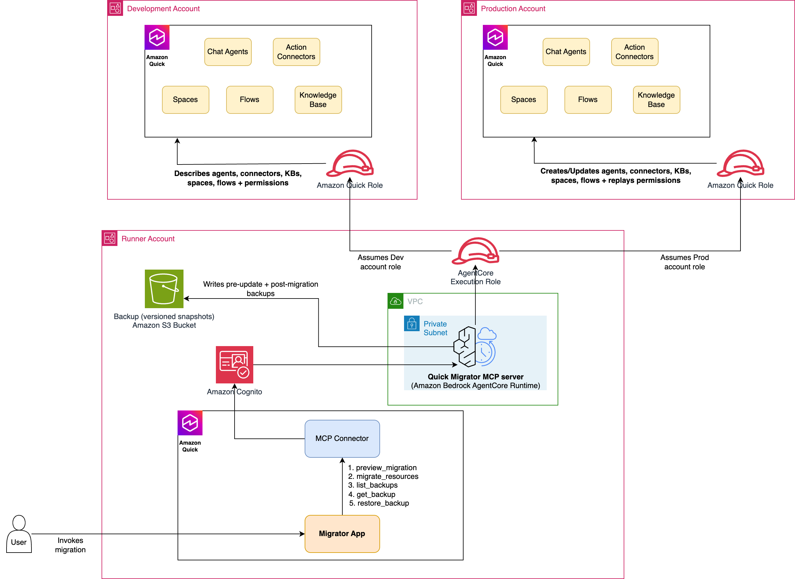

# Quick Agent Assets Deployment

Deploy and migrate **Amazon Quick** resources — Chat Agents, Action Connectors,
Knowledge Bases, Spaces, and Flows — between AWS accounts through a
[Model Context Protocol (MCP)](https://modelcontextprotocol.io) server hosted on
**Amazon Bedrock AgentCore Runtime**. The server can be driven directly from
Amazon Quick (as an action connector) or from any MCP-compatible client.

> The deployment is **resource-driven**: choose a resource type
> (`agent` | `connector` | `knowledge_base` | `space` | `flow`) and select
> resources by **id**, by **name**, or **all**. Agents are recreated with their
> Action Connectors attached (remapped to the target account); Spaces are
> recreated and re-linked to their resources (agents, connectors, KBs) with ARNs
> remapped; Flows are matched by name and their embedded resource ARNs remapped.
> Permissions are not hard-coded: the server *describes* each source resource's
> permissions and replays the identical actions in the target, remapping
> principals to a real registered user in the target account.
>
> Every migration takes a **backup** of any target resource it is about to
> overwrite and a **snapshot** of every resource it creates/updates, into a
> backup bucket in the runner account — and those backups can be listed and
> restored with the `list_backups` / `get_backup` / `restore_backup` tools.

---

## Problem statement

Promoting Quick resources from one account to another (for example,
`dev` → `prod`) by hand is slow and error-prone:

1. Each Agent, Action Connector, Knowledge Base, Space, and Flow must be
   recreated individually with the correct configuration.
2. Resource **permissions** must be re-granted, with principals remapped to the
   target account's registered users.
3. Agents must be recreated with their Action Connectors re-attached, Spaces
   re-linked to their resources, and Flow definitions rewritten so embedded
   source-account ARNs point at the target — so the migrated app behaves like
   the original.
4. S3-backed knowledge bases need their bucket, bucket policy, and data source
   provisioned before the KB can be registered; credential-backed KBs
   (SharePoint, Confluence, Google Drive, QBusiness) need a data source created
   in the target first.

Doing this repeatedly across environments is exactly the kind of deterministic,
idempotent work that should be automated.

## What this solution provides

- A single **`migrate_resources`** MCP tool that migrates a selected set of
  resources (Agents, Action Connectors, Knowledge Bases, Spaces, or Flows)
  cross-account in one call, and a read-only **`preview_migration`** tool that
  inventories both source and target and returns a source→target mapping.
- **Backup & restore** — `list_backups`, `get_backup`, and `restore_backup`
  tools built on the automatic pre-update backups and post-migration snapshots.
- **Simple selection** — pick a `resource_type` (`agent` | `connector` |
  `knowledge_base` | `space` | `flow`) and choose resources by **id**, by
  **name**, or **all**.
- **Idempotency (upsert)** — every resource is created-or-updated, so re-running
  a migration converges instead of producing duplicates. Before any update, a
  backup of the existing target resource is written; if the backup cannot be
  written, the update is aborted for that resource.
- **Agents keep their connectors; spaces keep their links; flows keep their
  references** — migrated agents are recreated with their Action Connectors
  attached (remapped to the target account); spaces are re-linked to their
  resources; flow definitions have their embedded source-account ARNs remapped
  to the target.
- **Permission fidelity** — permissions are copied by describing the source and
  replicating the exact actions, with principals resolved to a real user in the
  target account.
- **Infrastructure as code** — CloudFormation templates for the IAM roles, VPC
  network, and the AgentCore runtime (Cognito JWT auth + VPC network mode).

---

## Architecture



| Component | Account | Responsibility |
|-----------|---------|----------------|
| **AgentCore Runtime** (MCP server) | Central (Runner) | Hosts `server.py`; assumes into source & target; orchestrates the migration. Runs in VPC network mode with a Cognito JWT authorizer. |
| **Amazon Cognito** | Central (Runner) | User pool + resource server + app client. Issues the OAuth2 JWT (scope `invoke`) that callers present to AgentCore. |
| **Runner execution role** | Central (Runner) | AgentCore's execution role: Bedrock InvokeModel, CloudWatch Logs, X-Ray, and `sts:AssumeRole` into the source & target roles. |
| **`quick-space-migrator-role`** | Source | **Read-only** QuickSight describe/list permissions + KB read. |
| **`quick-space-migrator-role`** | Target | **Read-write** QuickSight create/update permissions + KB and S3 write + `ListUsers` for principal resolution. |

### Migration flow (`migrate_resources`)

1. **Resolve resources** — from `resource_type` + `search_by` (`id` | `name` |
   `all`) + `value`, resolve the concrete resource IDs in the source account.
2. **Migrate the selected type** (upsert — create if absent in target, else
   update the same resource after taking a pre-update backup):
   - **Connectors** — recreate each connector; authentication config is
     sanitized to the create (write) model with placeholder secrets, so
     connectors must be re-authenticated in the target UI. Copy permissions.
     Credential-backed connectors that the provider validates on create (e.g.
     Salesforce OAuth2) are reported as **SKIPPED** with re-auth guidance rather
     than a hard failure.
   - **Knowledge bases** — behavior branches on the **source KB type**:
     - **S3** — verify the QuickSight service role, create the target bucket
       (`knowledge-base-<source>-<account>`, or your `target_kb_bucket`) +
       bucket policy + data source + KB, preserving the source KB's filter
       configuration. (S3 objects are not copied.)
     - **WEB_CRAWLER** — replay the source data source (NO_AUTH) + KB config.
     - **SharePoint / Confluence / Google Drive / QBusiness** — these use a
       data source whose credentials **cannot** be copied across accounts. Pass
       `target_data_source_arn` (a data source you created in the target first)
       to migrate the KB structure against it; otherwise the KB is **SKIPPED**
       with guidance.

       Then copy KB permissions.
   - **Agents** — recreate each agent with its Action Connectors attached
     (remapped to the target account), then copy agent permissions.
   - **Spaces** — recreate each space and re-link its resources (agents,
     connectors, knowledge bases) with ARNs remapped to the target account
     (migrate those linked resources first so the target ARNs resolve), then
     copy space permissions.
   - **Flows** — matched by **name** (CreateFlow assigns a new id in the
     target); the flow definition's embedded source-account ARNs are remapped to
     the target account, then permissions are copied. A duplicate name in the
     target is treated as ambiguous and skipped.
3. **Back up & snapshot** — before overwriting any existing target resource a
   backup is written to the backup bucket; after a successful create/update a
   snapshot is written. Both land under `<name> (<id>)/<id>_v<N>.json`.
4. **Report** — return a JSON report of the created/updated resources, buckets,
   `skipped_permissions`, `backups`, `snapshots`, and errors.

> **Data note:** the migrator provisions the target KB bucket and registers the
> knowledge base, but does **not** copy the S3 objects themselves. Sync the
> documents (e.g. `aws s3 sync`) and trigger a KB ingestion separately. See
> [docs/knowledge-base-iam-setup.md](docs/knowledge-base-iam-setup.md).

---

## Repository layout

```
quick-space-migrator-mcp/
├── src/                              # The MCP server (flat modules, flattened into the bundle root)
│   ├── server.py                     #   MCP entrypoint: tools + do_migrate_resources dispatcher + preview + restore
│   ├── common.py                     #   Shared foundation: role assumption, error/ARN/auth helpers, resource maps, config
│   ├── resources.py                  #   Resource selection (resolve_resource_ids) + target existence/describe/permission helpers
│   ├── backups.py                    #   Backup catalog, pre-update backups, post-migration snapshots
│   ├── migrate_connectors.py         #   _migrate_connectors
│   ├── migrate_agents.py             #   _migrate_agents
│   ├── migrate_spaces.py             #   _migrate_spaces
│   ├── migrate_knowledge_bases.py    #   _migrate_knowledge_bases (+ KB bucket helpers)
│   └── migrate_flows.py              #   _migrate_flows (+ flow describe/remap/link helpers)
├── infrastructure/                   # CloudFormation templates (deploy in this order)
│   ├── runner-role.yaml              #   1. Central account: AgentCore execution role
│   ├── quick-migrator-role.yaml      #   2. Source & target account cross-account role
│   ├── network.yaml                  #   3. VPC, subnets, NAT, endpoints, security groups
│   └── agentcore-runtime.yaml        #   4. Cognito + AgentCore runtime
├── scripts/                          # Deployment automation (wrappers over the templates)
│   ├── build.sh                      #   Package src/*.py + deps → build/deployment.zip (ARM64)
│   ├── deploy-roles.sh               #   Deploy runner → source → target roles (ordered)
│   ├── deploy-network.sh             #   Deploy the VPC network stack
│   └── deploy.sh                     #   Build, upload artifact, deploy the runtime
├── examples/                         # Optional helper scripts for testing
│   ├── setup_source.py               #   Seed a source account with sample spaces/agents/KB
│   └── manage_agent_space.py         #   Attach/detach a space from an agent
├── docs/
│   ├── knowledge-base-iam-setup.md   #   KB IAM policy + S3 bucket naming convention
│   └── quick-app-integration.md      #   Build a Quick App on top of the MCP connector
├── images/
│   └── architecture.png
├── requirements.txt                  # Runtime dependencies (resolved at build time)
└── README.md
```

> License, contribution, and code-of-conduct files live at the **repository
> root** (`CONTRIBUTING.md`, `CODE_OF_CONDUCT.md`, `LICENSE`), not inside this
> sub-project.

No dependencies are vendored into the repository — `scripts/build.sh` resolves
them from PyPI at package time into a git-ignored `build/` directory.

---

## Prerequisites

Install the following locally:

- **AWS CLI v2** — configured with credentials/profiles for each account
- **Python 3.14** — the AgentCore runtime targets Python 3.14 on Linux ARM64
- **Bash** and **zip**
- Three AWS accounts (or three roles): **central/runner**, **source**, **target**
  (source and target may be the same account for a smoke test)

> **ARM64 note:** AgentCore Runtime runs on AWS Graviton (Linux `aarch64`).
> `scripts/build.sh` uses `pip --platform manylinux2014_aarch64 --only-binary=:all:`
> so it produces a correct bundle even when run from an Intel or Apple-Silicon
> Mac.

---

## Deployment

Deploy the stacks in the order below. All commands assume you are in the
repository root.

### 1. IAM roles (runner → source → target)

The runner execution role is created **first** so the source/target trust
policies can reference its ARN directly (no chicken-and-egg). Account IDs are
derived automatically from each CLI profile.

```bash
./scripts/deploy-roles.sh \
  --runner-profile central \
  --source-profile source-acct \
  --target-profile target-acct \
  --artifact-bucket my-agentcore-artifacts
```

### 2. VPC network

AgentCore only supports specific Availability Zone **IDs** (in `us-east-1`:
`use1-az1`, `use1-az2`, `use1-az4`). The script prints the AZ name→ID mapping so
you can confirm before deploying.

```bash
./scripts/deploy-network.sh --az1 us-east-1a --az2 us-east-1b
```

### 3. Build + deploy the AgentCore runtime

`deploy.sh` runs `build.sh`, uploads the artifact to S3, deploys the Cognito +
runtime stack, and prints the token endpoint and client credentials.

```bash
./scripts/deploy.sh \
  --artifact-bucket my-agentcore-artifacts \
  --source-role-arn arn:aws:iam::<SOURCE_ACCOUNT_ID>:role/quick-space-migrator-role \
  --target-role-arn arn:aws:iam::<TARGET_ACCOUNT_ID>:role/quick-space-migrator-role \
  --cognito-domain-prefix quick-migrator-<CENTRAL_ACCOUNT_ID> \
  --runner-role-stack quick-space-migrator-runner-role \
  --network-stack quick-migrator-network
```

On success the script prints the **Runtime ARN**, **token endpoint**, **app
client ID/secret**, and a ready-to-run `curl` snippet for obtaining a JWT.

### Runtime configuration

The runtime needs only two environment variables (plain-string role ARNs, not
secrets):

| Variable | Description |
|----------|-------------|
| `SOURCE_ROLE_ARN` | `quick-space-migrator-role` ARN in the source account |
| `TARGET_ROLE_ARN` | `quick-space-migrator-role` ARN in the target account |

Everything else (accounts, resource selection, envs, QuickSight service role) is
passed as a **tool input** at invocation time.

---

## MCP tools

| Tool | Type | Description |
|------|------|-------------|
| `preview_migration` | read-only | Dry run: inventory the agents, connectors, knowledge bases, spaces, and flows that would be migrated, scan the target account, and return a source→target mapping (which resources already exist as CREATE vs UPDATE). |
| `migrate_resources` | read-write | Migrate the selected resources of one type into the target and copy permissions. Upsert semantics with a pre-update backup. |
| `list_backups` | read-only | List backed-up/snapshotted assets in the backup bucket (optionally filtered by name/id substring), grouped by asset with their versions. |
| `get_backup` | read-only | Fetch a specific backup envelope (a given asset + version, or the latest) including its captured dependencies. |
| `restore_backup` | read-write | Restore an asset from a backup version into the target, re-establishing links (without modifying the linked resources' own configs). |

Both migration tools share the same selection model: `resource_type`
(`agent` | `connector` | `knowledge_base` | `space` | `flow`) +
`search_by` (`id` | `name` | `all`) + `value`.

### `migrate_resources` inputs

| Input | Default | Description |
|-------|---------|-------------|
| `source_account_id` | — | 12-digit source AWS account ID |
| `target_account_id` | — | 12-digit target AWS account ID |
| `resource_type` | — | `agent`, `connector`, `knowledge_base`, `space`, or `flow` |
| `search_by` | `"all"` | `id`, `name`, or `all` |
| `value` | `""` | The id or name to match (required when `search_by` is `id` or `name`) |
| `region` | `"us-east-1"` | AWS region |
| `source_env` | `"dev"` | Env segment used in KB bucket naming |
| `target_env` | `"prod"` | Env segment used in KB bucket naming |
| `qs_service_role` | `aws-quicksight-service-role-v0` | QuickSight service role for the KB bucket policy (no API exists to look this up) |
| `target_kb_bucket` | `""` | **(S3 KBs only)** Optional target S3 bucket for the KB's data source. Must start with `knowledge-base-`. If omitted, a bucket named `knowledge-base-<source>-<target_account_id>` is created. |
| `target_data_source_arn` | `""` | **(credentialed KB types — SharePoint, Confluence, Google Drive, QBusiness)** ARN of a data source you already created in the target account (its connection/auth cannot be copied across accounts). If omitted, such KBs are skipped with guidance. |

### `preview_migration` inputs

| Input | Default | Description |
|-------|---------|-------------|
| `source_account_id` | — | Source AWS account ID |
| `target_account_id` | `""` | Target AWS account ID — when set, the target is scanned and each source resource is mapped to CREATE (absent) or UPDATE (already present) |
| `resource_type` | `"all"` | `agent`, `connector`, `knowledge_base`, `space`, `flow`, or `all` (inventory every type) |
| `search_by` | `"all"` | `id`, `name`, or `all` |
| `value` | `""` | The id or name to match (required when `search_by` is `id` or `name`) |
| `region` | `"us-east-1"` | AWS region |
| `include_permissions` | `false` | When `true`, also describe each resource's permissions in the inventory (slower) |

`migrate_resources` returns a JSON report with the created/updated agents,
connectors, knowledge bases, spaces, and flows, and buckets, plus
`skipped_permissions` (principals that could not be resolved in the target),
`backups`, and `snapshots`.

---

## Integrating with Amazon Quick

Once the runtime is healthy, register it in Amazon Quick as an **MCP action
connector**, then let Quick build an app on top of it. You only need to create
**two connectors** — the migrator MCP connector and (optionally) a Slack
connector for notifications; Quick generates the app UI for you from the
instructions in [docs/quick-app-integration.md](docs/quick-app-integration.md).

### 1. Register the migrator MCP connector

- **Type:** Action (MCP)
- **Endpoint:** the AgentCore MCP invocations URL from `deploy.sh`:
  `https://bedrock-agentcore.<region>.amazonaws.com/runtimes/<url-encoded-runtime-ARN>/invocations?qualifier=DEFAULT`
- **Network:** **Public** — the AgentCore endpoint is public even in VPC network
  mode (VPC mode only affects the runtime's *outbound* traffic).
- **Authentication:** OAuth2 via the Cognito **client ID**, **client secret**,
  token endpoint, and scope printed by `deploy.sh`. Register these with the
  connector's OAuth settings.
- Exposes the migration and backup/restore actions: `preview_migration`,
  `migrate_resources`, `list_backups`, `get_backup`, and `restore_backup`.

### 2. (Optional) Register a Slack connector

- **Type:** Action
- **Action:** `ChatPostMessage` — used to post a summary to a channel after a
  migration completes.

### 3. Let Quick build the app

Open Amazon Quick, point it at the two connectors, and provide the build
specification in [docs/quick-app-integration.md](docs/quick-app-integration.md).
Quick generates the full web app (migration form, preview, confirmation,
results view, Slack notification, and history) — no front-end code to write by
hand.

> **MCP connector tips**
>
> - Tool `inputSchema` must be JSON Schema **Draft 7** (`required` as an array).
> - MCP operations have a **60-second** timeout — keep individual calls fast.
> - Connectors migrated by this tool carry placeholder secrets and must be
>   **re-authenticated** in the target account's UI.

---

## Testing with the example scripts

Seed a source account with two spaces (one with a Slack connector, one with an
S3 knowledge base) and their agents:

```bash
python3 examples/setup_source.py \
  --account-id <SOURCE_ACCOUNT_ID> \
  --region us-east-1 --env dev \
  --qs-service-role aws-quicksight-service-role-v0
```

Inspect or adjust an agent's connector attachments:

```bash
python3 examples/manage_agent_space.py show \
  --account-id <ACCOUNT_ID> --agent-id analytics-agent
```

---

## Limitations

- **S3 objects are not copied.** The migrator provisions the target KB bucket
  and registers the knowledge base, but you must sync the documents and trigger
  ingestion yourself.
- **Credential-backed knowledge bases need a target data source.** SharePoint,
  Confluence, Google Drive, and QBusiness KBs use a data source whose
  credentials cannot be read from the source or created headless. Create the
  connection/data source in the target account first, then pass its ARN as
  `target_data_source_arn`; otherwise these KBs are skipped with guidance.
- **Connectors require re-authentication.** Secrets are never read from the
  source; migrated connectors carry placeholders and must be re-authorized in
  the target UI. Connectors whose provider validates credentials on create
  (e.g. Salesforce OAuth2) are skipped with re-auth guidance.
- **Flows are matched by name.** CreateFlow assigns a new id in the target, so
  flows are matched to the target by name; a duplicate target name is ambiguous
  and skipped.
- **Principal resolution depends on target registration.** Permissions are
  granted to a target user only if that identity has been registered in the
  target account (i.e. has signed into QuickSight there at least once).
  Unresolved principals are reported under `skipped_permissions`.
- **60-second MCP timeout.** Very large migrations (many KBs/agents that sit in
  a transient state) may approach the MCP socket timeout; the server-side
  operation still completes.

---

## Security

- No credentials or secrets are stored in this repository. The runtime uses only
  two plain-string role ARNs; the Cognito client secret is fetched from the
  Cognito API by `deploy.sh` and never committed.
- Cross-account access is least-privilege: the source role is read-only and the
  target role is scoped to the QuickSight/KB/S3 actions required.
- See [How to Contribute](/CONTRIBUTING.md) for how to report a security
  issue.

## Contributing

See [How to Contribute](/CONTRIBUTING.md).

## License

This library is licensed under the MIT-0 License. See the [LICENSE](/LICENSE)
file.
