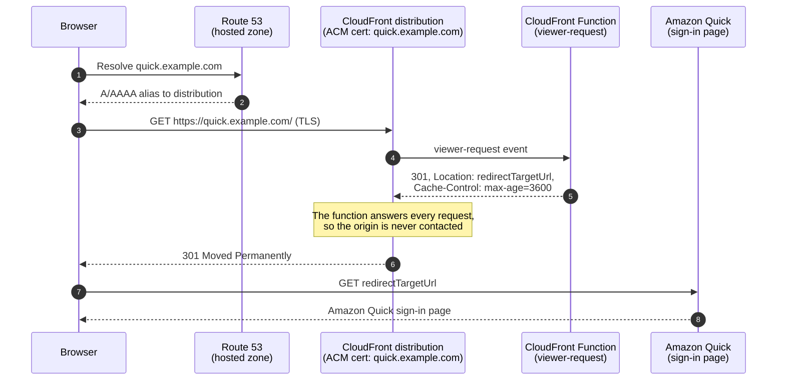

# Custom Domain for Amazon Quick Sign-In

Point a custom domain at your Amazon Quick sign-in URL. This CDK app deploys
an AWS Certificate Manager (ACM) certificate for your domain, an Amazon
CloudFront distribution whose viewer-request function returns an HTTP `301` to
your sign-in URL, and Amazon Route 53 alias records. Your domain and target URL
are passed as [CDK context](https://docs.aws.amazon.com/cdk/v2/guide/context.html)
at deploy time.

See the [Amazon Quick documentation](https://docs.aws.amazon.com/quick/latest/userguide/)
for more on Quick itself.

## Architecture

The examples below use `quick.example.com` as a placeholder for your own
domain. Substitute the domain your hosted zone owns wherever it appears.

The sequence diagram shows what happens when a visitor browses to your domain.



Each numbered step:

1. The browser asks DNS to resolve `quick.example.com`. The query lands on
   your Route 53 hosted zone.
2. Route 53 answers with the alias records this stack created, which resolve
   to the IP addresses of the CloudFront distribution.
3. The browser opens a TLS connection to CloudFront and requests the page.
   CloudFront presents the ACM certificate for `quick.example.com`, so the
   connection is trusted.
4. CloudFront hands the request to the CloudFront Function, which runs on
   every incoming request before any cache or origin lookup.
5. The function immediately returns a `301` response with your
   `redirectTargetUrl` in the `Location` header and a one-hour
   `Cache-Control`, so repeat visitors skip straight to step 7. The
   distribution's origin is never contacted.
6. CloudFront passes that `301` back to the browser.
7. The browser follows the `Location` header and requests your Amazon Quick
   sign-in URL.
8. Amazon Quick serves its sign-in page and the visitor logs in as usual.

The stack deploys to `us-east-1` because CloudFront requires the ACM
certificate for a custom domain to be issued in US East (N. Virginia), per the
[CloudFront SSL/TLS certificate requirements](https://docs.aws.amazon.com/AmazonCloudFront/latest/DeveloperGuide/cnames-and-https-requirements.html).
This doesn't constrain where your visitors or other workloads are. CloudFront
and Route 53 are global services, so the redirect behaves identically
everywhere.

## Design considerations

**Why not just a DNS record?** DNS has no way to express a path or query
string. A CNAME or alias record can point `quick.example.com` at another host,
but it cannot deliver a visitor to `/sn/auth/signin?directory_alias=...`, and
the Amazon Quick endpoint presents a TLS certificate for its own hostname
rather than yours, so a bare DNS pointer fails with certificate errors in
every browser.

**Why not an HTTP redirect?** Many domains, including the entire `.dev`
top-level domain, are on the [HSTS preload list](https://hstspreload.org/)
baked into browsers, which means the browser only ever attempts HTTPS. The fix
is an HTTPS [`301 Moved Permanently`](https://developer.mozilla.org/en-US/docs/Web/HTTP/Status/301)
served by something holding a valid certificate for your domain, which is what
this stack provides.

## Glossary

- **Hosted zone**: the container in Route 53 that holds the DNS records for a
  domain. This stack looks up your existing public hosted zone and never
  creates one. See [working with hosted zones](https://docs.aws.amazon.com/Route53/latest/DeveloperGuide/hosted-zones-working-with.html).
- **Alias record**: a Route 53 record type that points a name at an AWS
  resource such as a CloudFront distribution. It works at the zone apex, where
  CNAMEs are forbidden, and queries to it are free. See
  [choosing between alias and non-alias records](https://docs.aws.amazon.com/Route53/latest/DeveloperGuide/resource-record-sets-choosing-alias-non-alias.html).
- **ACM certificate with DNS validation**: a free, auto-renewing public TLS
  certificate. ACM proves you own the domain through a DNS record this stack
  writes into your hosted zone automatically. See
  [DNS validation](https://docs.aws.amazon.com/acm/latest/userguide/dns-validation.html).
- **CloudFront distribution**: the CDN endpoint that terminates TLS for your
  domain at AWS edge locations. Here it exists to hold the certificate and run
  the function. It never fetches content.
- **CloudFront Function**: a short JavaScript function that runs at the edge on
  the viewer-request event, which fires when a request arrives and before any
  cache or origin lookup. Because it returns a response directly, the request
  is answered on the spot. See
  [CloudFront Functions](https://docs.aws.amazon.com/AmazonCloudFront/latest/DeveloperGuide/cloudfront-functions.html).
- **Placeholder origin**: CloudFront requires every distribution to declare an
  origin server. Ours is syntactically present but never contacted, because the
  viewer-request function answers first.
- **301 Moved Permanently**: the HTTP status telling browsers and caches that
  the resource lives permanently at the URL in the `Location` header. See
  [MDN on 301](https://developer.mozilla.org/en-US/docs/Web/HTTP/Status/301).
- **HSTS preload**: a list shipped inside browsers of domains that must only be
  reached over HTTPS. Entire TLDs like `.dev` are on it. See
  [hstspreload.org](https://hstspreload.org/).
- **Directory alias**: the identifier of your Amazon Quick instance, visible as
  the `directory_alias` query parameter in your sign-in URL and in the Amazon
  Quick admin console.
- **CDK context**: key/value input passed to a CDK app at synth time with `-c`
  flags or `cdk.context.json`. See
  [context values](https://docs.aws.amazon.com/cdk/v2/guide/context.html).

## Prerequisites

- A Route 53 **public hosted zone** for your domain, already created and
  delegated in the target AWS account. This stack does not create the zone. It
  looks the zone up at deploy time and fails if it doesn't exist.
- **Node.js 20+** and AWS credentials for that account.
- CDK bootstrapped in `us-east-1`: `npx cdk bootstrap aws://<account>/us-east-1`.
  See [CDK bootstrapping](https://docs.aws.amazon.com/cdk/v2/guide/bootstrapping.html).

## Get the code

The source lives in this repository under
[`docs/infrastructure as code/quick-custom-domain-redirect`](https://github.com/aws-samples/sample-amazon-quick-suite-knowledge-hub/tree/main/docs/infrastructure%20as%20code/quick-custom-domain-redirect).

```bash
git clone https://github.com/aws-samples/sample-amazon-quick-suite-knowledge-hub.git
cd 'sample-amazon-quick-suite-knowledge-hub/docs/infrastructure as code/quick-custom-domain-redirect'
```

## Deploy

```bash
npm install

npx cdk deploy \
  -c domainName=quick.example.com \
  -c redirectTargetUrl='https://us-east-1.quicksight.aws.amazon.com/sn/auth/signin?directory_alias=your-quick-account-name'
```

If your hosted zone name differs from the domain, add `-c hostedZoneDomain=<zone>`.
To keep resources on stack deletion, add `-c retain=true`. Required context is
validated at synth time and fails with a message naming the missing key, or
rejecting a `redirectTargetUrl` that is not an `https://` URL.

To find your Quick account name, open the Amazon Quick admin console. The
account name (directory alias) is the account-name segment in your sign-in URL.
Substitute it for `your-quick-account-name` in `redirectTargetUrl`.

## Verify

```bash
curl -sI https://quick.example.com/
```

Expect `HTTP/2 301` and a `Location:` header equal to your `redirectTargetUrl`.

## Cost

At demo traffic this costs pennies. CloudFront Functions bill about $0.10 per
million invocations and there is no idle charge, since there is no load
balancer or bucket. See [Amazon CloudFront pricing](https://aws.amazon.com/cloudfront/pricing/)
for current rates.

## Cleanup

```bash
npx cdk destroy \
  -c domainName=quick.example.com \
  -c redirectTargetUrl='https://us-east-1.quicksight.aws.amazon.com/sn/auth/signin?directory_alias=your-quick-account-name'
```
