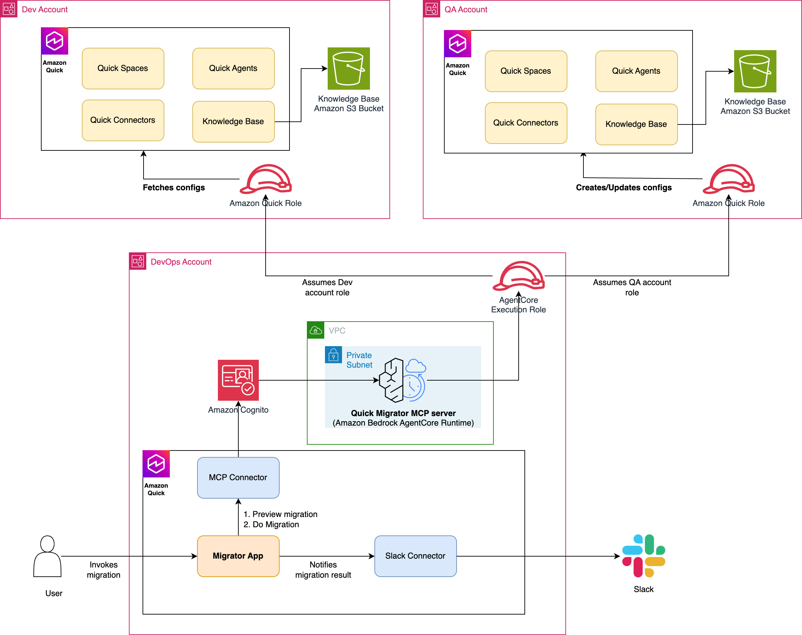

# Quick Resource Migrator — Amazon Bedrock AgentCore MCP Server

Migrate **Amazon Quick Suite** resources — Chat Agents, Action Connectors, and
S3 Knowledge Bases — between AWS accounts through a
[Model Context Protocol (MCP)](https://modelcontextprotocol.io) server hosted on
**Amazon Bedrock AgentCore Runtime**. The server can be driven directly from
Amazon Quick (as an action connector) or from any MCP-compatible client.

> The migrator is **resource-driven**: choose a resource type
> (`agent` | `connector` | `knowledge_base`) and select resources by **id**, by
> **name**, or **all**. Spaces are not created or linked. Agents are recreated
> with their Action Connectors attached (remapped to the target account) but
> with no Space attachment. Permissions are not hard-coded: the server
> *describes* each source resource's permissions and replays the identical
> actions in the target, remapping principals to a real registered user in the
> target account.

---

## Problem statement

Promoting Quick resources from one account to another (for example,
`dev` → `prod`) by hand is slow and error-prone:

1. Each Agent, Action Connector, and Knowledge Base must be recreated
   individually with the correct configuration.
2. Resource **permissions** must be re-granted, with principals remapped to the
   target account's registered users.
3. Agents must be recreated with their Action Connectors re-attached so the
   migrated app behaves like the original.
4. S3-backed knowledge bases need their bucket, bucket policy, and data source
   provisioned before the KB can be registered.

Doing this repeatedly across environments is exactly the kind of deterministic,
idempotent work that should be automated.

## What this solution provides

- A single **`migrate_resources`** MCP tool that migrates a selected set of
  resources (Agents, Action Connectors, or S3 Knowledge Bases) cross-account in
  one call, and a read-only **`preview_migration`** tool for a dry run.
- **Simple selection** — pick a `resource_type` (`agent` | `connector` |
  `knowledge_base`) and choose resources by **id**, by **name**, or **all**. No
  Spaces are involved in selection or migration.
- **Idempotency** — every resource is created-or-updated, so re-running a
  migration converges instead of producing duplicates.
- **Agents keep their connectors** — migrated agents are recreated with their
  Action Connectors attached (remapped to the target account) but with **no
  Space attachment**.
- **Permission fidelity** — permissions are copied by describing the source and
  replicating the exact actions, with principals resolved to a real user in the
  target account.
- **Infrastructure as code** — CloudFormation templates for the IAM roles, VPC
  network, and the AgentCore runtime (Cognito JWT auth + VPC network mode).

---

## Architecture



| Component | Account | Responsibility |
|-----------|---------|----------------|
| **AgentCore Runtime** (MCP server) | Central (Runner) | Hosts `server.py`; assumes into source & target; orchestrates the migration. Runs in VPC network mode with a Cognito JWT authorizer. |
| **Amazon Cognito** | Central (Runner) | User pool + resource server + app client. Issues the OAuth2 JWT (scope `invoke`) that callers present to AgentCore. |
| **Runner execution role** | Central (Runner) | AgentCore's execution role: Bedrock InvokeModel, CloudWatch Logs, X-Ray, and `sts:AssumeRole` into the source & target roles. |
| **`quick-space-migrator-role`** | Source | **Read-only** QuickSight describe/list permissions + KB read. |
| **`quick-space-migrator-role`** | Target | **Read-write** QuickSight create/update permissions + KB and S3 write + `ListUsers` for principal resolution. |

### Migration flow (`migrate_resources`)

1. **Resolve resources** — from `resource_type` + `search_by` (`id` | `name` |
   `all`) + `value`, resolve the concrete resource IDs in the source account.
2. **Migrate the selected type:**
   - **Connectors** — recreate each connector; authentication config is
     sanitized to the create (write) model with placeholder secrets, so
     connectors must be re-authenticated in the target UI. Copy permissions.
   - **Knowledge bases** — verify the QuickSight service role, create the target
     bucket (`knowledge-base-<env>-<account>`) + bucket policy + data source +
     KB, then copy KB permissions. (S3 objects are not copied.)
   - **Agents** — recreate each agent with its Action Connectors attached
     (remapped to the target account) and **no Space attachment**, then copy
     agent permissions.
3. **Report** — return a JSON report of the created/updated resources, buckets,
   `skipped_permissions`, and errors.

> **Data note:** the migrator provisions the target KB bucket and registers the
> knowledge base, but does **not** copy the S3 objects themselves. Sync the
> documents (e.g. `aws s3 sync`) and trigger a KB ingestion separately. See
> [docs/knowledge-base-iam-setup.md](docs/knowledge-base-iam-setup.md).

---

## Repository layout

```
quick-space-migrator-mcp/
├── src/
│   └── server.py                     # The MCP server (the only first-party runtime file)
├── infrastructure/                   # CloudFormation templates (deploy in this order)
│   ├── runner-role.yaml              #   1. Central account: AgentCore execution role
│   ├── quick-migrator-role.yaml      #   2. Source & target account cross-account role
│   ├── network.yaml                  #   3. VPC, subnets, NAT, endpoints, security groups
│   └── agentcore-runtime.yaml        #   4. Cognito + AgentCore runtime
├── scripts/                          # Deployment automation (wrappers over the templates)
│   ├── build.sh                      #   Package server.py + deps → build/deployment.zip (ARM64)
│   ├── deploy-roles.sh               #   Deploy runner → source → target roles (ordered)
│   ├── deploy-network.sh             #   Deploy the VPC network stack
│   └── deploy.sh                     #   Build, upload artifact, deploy the runtime
├── examples/                         # Optional helper scripts for testing
│   ├── setup_source.py               #   Seed a source account with sample spaces/agents/KB
│   └── manage_agent_space.py         #   Attach/detach a space from an agent
├── docs/
│   ├── knowledge-base-iam-setup.md   #   KB IAM policy + S3 bucket naming convention
│   └── quick-app-integration.md      #   Build a Quick App on top of the MCP connector
├── images/
│   └── architecture.svg
├── requirements.txt                  # Runtime dependencies (resolved at build time)
├── README.md
├── CONTRIBUTING.md
├── CODE_OF_CONDUCT.md
├── THIRD_PARTY_LICENSES
└── LICENSE
```

No dependencies are vendored into the repository — `scripts/build.sh` resolves
them from PyPI at package time into a git-ignored `build/` directory.

---

## Prerequisites

Install the following locally:

- **AWS CLI v2** — configured with credentials/profiles for each account
- **Python 3.14** — the AgentCore runtime targets Python 3.14 on Linux ARM64
- **Bash** and **zip**
- Three AWS accounts (or three roles): **central/runner**, **source**, **target**
  (source and target may be the same account for a smoke test)

> **ARM64 note:** AgentCore Runtime runs on AWS Graviton (Linux `aarch64`).
> `scripts/build.sh` uses `pip --platform manylinux2014_aarch64 --only-binary=:all:`
> so it produces a correct bundle even when run from an Intel or Apple-Silicon
> Mac.

---

## Deployment

Deploy the stacks in the order below. All commands assume you are in the
repository root.

### 1. IAM roles (runner → source → target)

The runner execution role is created **first** so the source/target trust
policies can reference its ARN directly (no chicken-and-egg). Account IDs are
derived automatically from each CLI profile.

```bash
./scripts/deploy-roles.sh \
  --runner-profile central \
  --source-profile source-acct \
  --target-profile target-acct \
  --artifact-bucket my-agentcore-artifacts
```

### 2. VPC network

AgentCore only supports specific Availability Zone **IDs** (in `us-east-1`:
`use1-az1`, `use1-az2`, `use1-az4`). The script prints the AZ name→ID mapping so
you can confirm before deploying.

```bash
./scripts/deploy-network.sh --az1 us-east-1a --az2 us-east-1b
```

### 3. Build + deploy the AgentCore runtime

`deploy.sh` runs `build.sh`, uploads the artifact to S3, deploys the Cognito +
runtime stack, and prints the token endpoint and client credentials.

```bash
./scripts/deploy.sh \
  --artifact-bucket my-agentcore-artifacts \
  --source-role-arn arn:aws:iam::<SOURCE_ACCOUNT_ID>:role/quick-space-migrator-role \
  --target-role-arn arn:aws:iam::<TARGET_ACCOUNT_ID>:role/quick-space-migrator-role \
  --cognito-domain-prefix quick-migrator-<CENTRAL_ACCOUNT_ID> \
  --runner-role-stack quick-space-migrator-runner-role \
  --network-stack quick-migrator-network
```

On success the script prints the **Runtime ARN**, **token endpoint**, **app
client ID/secret**, and a ready-to-run `curl` snippet for obtaining a JWT.

### Runtime configuration

The runtime needs only two environment variables (plain-string role ARNs, not
secrets):

| Variable | Description |
|----------|-------------|
| `SOURCE_ROLE_ARN` | `quick-space-migrator-role` ARN in the source account |
| `TARGET_ROLE_ARN` | `quick-space-migrator-role` ARN in the target account |

Everything else (accounts, resource selection, envs, QuickSight service role) is
passed as a **tool input** at invocation time.

---

## MCP tools

| Tool | Type | Description |
|------|------|-------------|
| `preview_migration` | read-only | Dry run: inventory the agents, connectors, and knowledge bases that would be migrated for the given selection. |
| `migrate_resources` | read-write | Migrate the selected resources of one type into the target, copy permissions. Agents keep their connectors but get no Space attachment. |

Both tools share the same selection model: `resource_type` +
`search_by` (`id` | `name` | `all`) + `value`.

### `migrate_resources` inputs

| Input | Default | Description |
|-------|---------|-------------|
| `source_account_id` | — | 12-digit source AWS account ID |
| `target_account_id` | — | 12-digit target AWS account ID |
| `resource_type` | — | `agent`, `connector`, or `knowledge_base` |
| `search_by` | `"all"` | `id`, `name`, or `all` |
| `value` | `""` | The id or name to match (required when `search_by` is `id` or `name`) |
| `region` | `"us-east-1"` | AWS region |
| `source_env` | `"dev"` | Env segment of the source KB bucket name |
| `target_env` | `"prod"` | Env segment of the target KB bucket name |
| `qs_service_role` | `aws-quicksight-service-role-v0` | QuickSight service role for the KB bucket policy (no API exists to look this up) |

### `preview_migration` inputs

| Input | Default | Description |
|-------|---------|-------------|
| `source_account_id` | — | Source AWS account ID |
| `resource_type` | `"all"` | `agent`, `connector`, `knowledge_base`, or `all` (inventory every type) |
| `search_by` | `"all"` | `id`, `name`, or `all` |
| `value` | `""` | The id or name to match (required when `search_by` is `id` or `name`) |
| `region` | `"us-east-1"` | AWS region |

`migrate_resources` returns a JSON report with the created/updated agents,
connectors, knowledge bases, and buckets, plus a `skipped_permissions` block for
any principals that could not be resolved in the target account.

---

## Integrating with Amazon Quick

Once the runtime is healthy, register it in Amazon Quick as an **MCP action
connector**, then let Quick build an app on top of it. You only need to create
**two connectors** — the migrator MCP connector and (optionally) a Slack
connector for notifications; Quick generates the app UI for you from the
instructions in [docs/quick-app-integration.md](docs/quick-app-integration.md).

### 1. Register the migrator MCP connector

- **Type:** Action (MCP)
- **Endpoint:** the AgentCore MCP invocations URL from `deploy.sh`:
  `https://bedrock-agentcore.<region>.amazonaws.com/runtimes/<url-encoded-runtime-ARN>/invocations?qualifier=DEFAULT`
- **Network:** **Public** — the AgentCore endpoint is public even in VPC network
  mode (VPC mode only affects the runtime's *outbound* traffic).
- **Authentication:** OAuth2 via the Cognito **client ID**, **client secret**,
  token endpoint, and scope printed by `deploy.sh`. Register these with the
  connector's OAuth settings.
- Exposes two actions: `preview_migration` and `migrate_resources`.

### 2. (Optional) Register a Slack connector

- **Type:** Action
- **Action:** `ChatPostMessage` — used to post a summary to a channel after a
  migration completes.

### 3. Let Quick build the app

Open Amazon Quick, point it at the two connectors, and provide the build
specification in [docs/quick-app-integration.md](docs/quick-app-integration.md).
Quick generates the full web app (migration form, preview, confirmation,
results view, Slack notification, and history) — no front-end code to write by
hand.

> **MCP connector tips**
>
> - Tool `inputSchema` must be JSON Schema **Draft 7** (`required` as an array).
> - MCP operations have a **60-second** timeout — keep individual calls fast.
> - Connectors migrated by this tool carry placeholder secrets and must be
>   **re-authenticated** in the target account's UI.

---

## Testing with the example scripts

Seed a source account with two spaces (one with a Slack connector, one with an
S3 knowledge base) and their agents:

```bash
python3 examples/setup_source.py \
  --account-id <SOURCE_ACCOUNT_ID> \
  --region us-east-1 --env dev \
  --qs-service-role aws-quicksight-service-role-v0
```

Inspect or adjust an agent's connector attachments:

```bash
python3 examples/manage_agent_space.py show \
  --account-id <ACCOUNT_ID> --agent-id analytics-agent
```

---

## Limitations

- **S3 objects are not copied.** The migrator provisions the target KB bucket
  and registers the knowledge base, but you must sync the documents and trigger
  ingestion yourself.
- **Connectors require re-authentication.** Secrets are never read from the
  source; migrated connectors carry placeholders and must be re-authorized in
  the target UI.
- **Principal resolution depends on target registration.** Permissions are
  granted to a target user only if that identity has been registered in the
  target account (i.e. has signed into QuickSight there at least once).
  Unresolved principals are reported under `skipped_permissions`.
- **60-second MCP timeout.** Very large migrations (many KBs/agents that sit in
  a transient state) may approach the MCP socket timeout; the server-side
  operation still completes.

---

## Security

- No credentials or secrets are stored in this repository. The runtime uses only
  two plain-string role ARNs; the Cognito client secret is fetched from the
  Cognito API by `deploy.sh` and never committed.
- Cross-account access is least-privilege: the source role is read-only and the
  target role is scoped to the QuickSight/KB/S3 actions required.
- See [How to Contribute](/HOW-TO-CONTRIBUTE.md) for how to report a security
  issue.

## Contributing

See [How to Contribute](/HOW-TO-CONTRIBUTE.md).

## License

This library is licensed under the MIT-0 License. See the [LICENSE](/LICENSE)
file.
